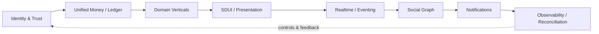
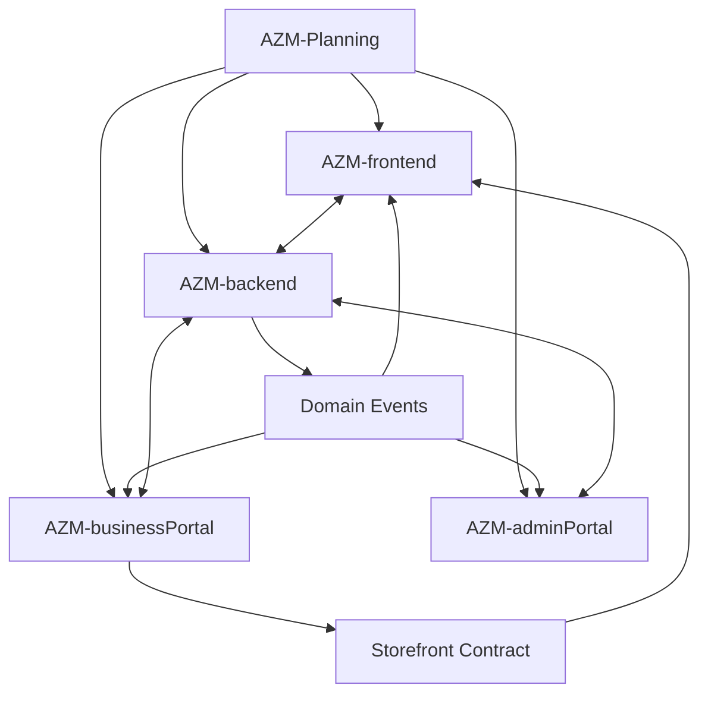
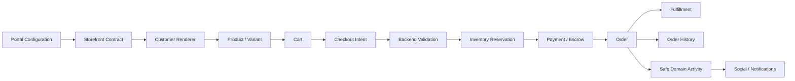
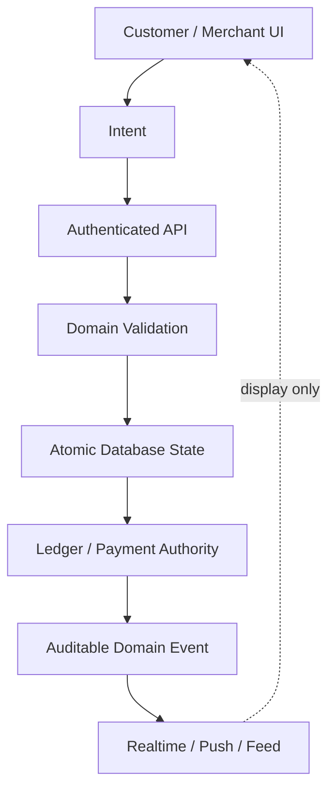
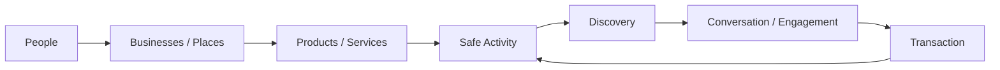

# AZM Architecture Visual Maps

**Status:** IN PROGRESS / REFERENCE  
**Last updated:** 2026-08-30 (UTC)

This document collects the highest-value visual maps for readers who want to understand AZM's architecture before reading the detailed plans. The individual repository plans contain diagrams at the points where the flow matters to the surrounding explanation.

## Master platform

## Cross-repository relationship

`AZM-Planning` records the intended architecture and verified project history; it does not become a runtime dependency.

## Retail end-to-end

## Financial truth boundary

The UI never becomes the authority for money, balances, inventory, payment settlement, or protected state.

## Social-to-commerce loop

The loop is intentionally constrained: sensitive payment instruments, balances, private transaction metadata and other protected financial details do not become public social activity.

## Agent reading order

1. Start with `README.md` for the master architecture.
2. Use the relevant repository plan for implementation state and detailed flows.
3. Use this file when a visual architecture map provides faster orientation.
4. Treat diagrams as explanatory views, not independent sources of implementation truth; update them whenever a depicted architectural boundary materially changes.
