# AZM Architecture Visual Maps

**Status:** IN PROGRESS / LIVING REFERENCE  
**Last updated:** 2026-08-30 (UTC)

This document collects the highest-value visual maps for readers who want to understand AZM's architecture before reading the detailed plans. The individual repository plans contain diagrams at the points where the flow matters to the surrounding explanation.

Diagrams are explanatory views, not independent implementation truth. When implementation changes a depicted boundary or lifecycle, update the relevant map and the repository plan in the same planning batch.

## Master platform

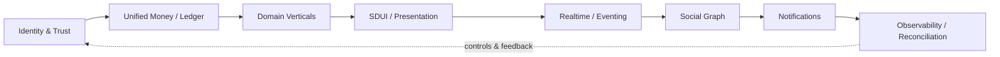

## Cross-repository relationship

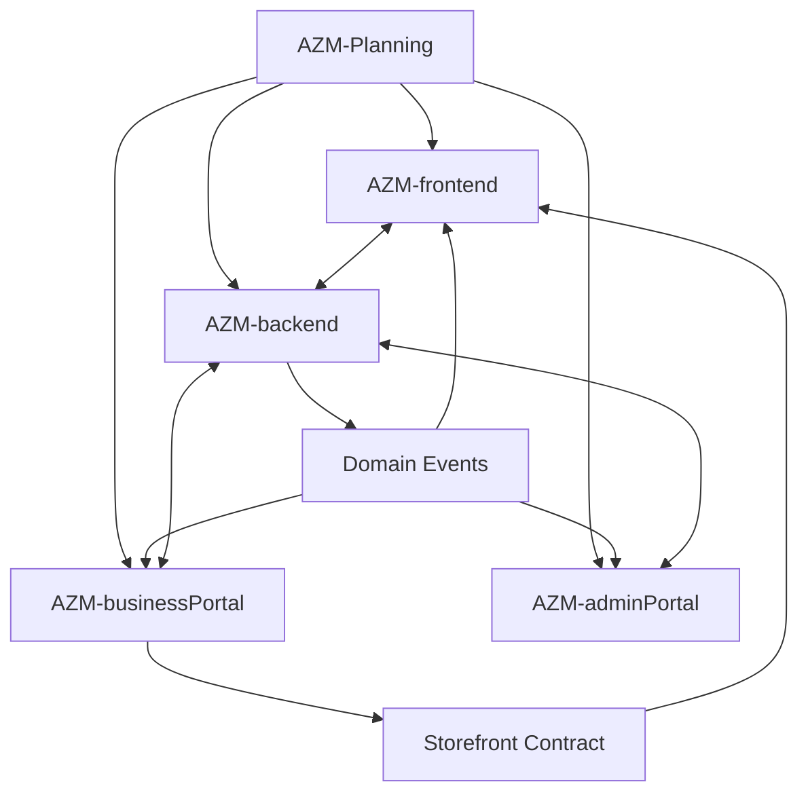

`AZM-Planning` records intended architecture and verified project history; it does not become a runtime dependency.

## Retail end-to-end

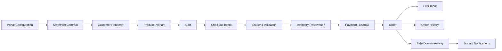

## Financial truth boundary

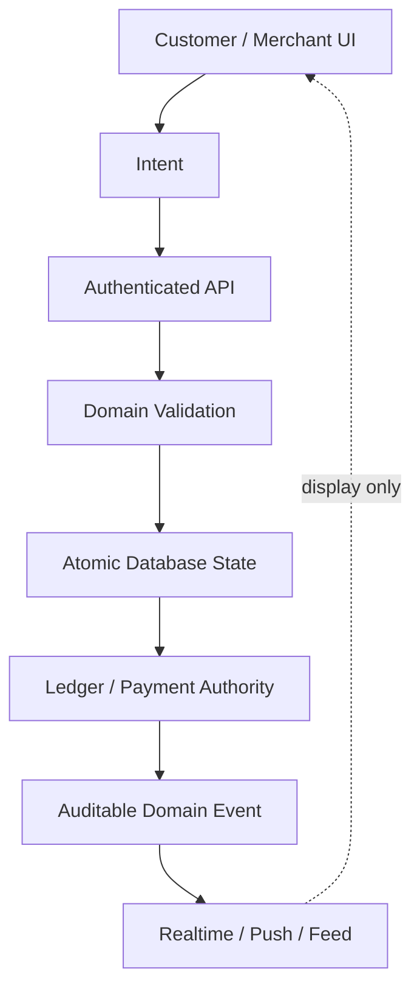

The UI never becomes the authority for money, balances, inventory, payment settlement, or protected state.

## Financial transaction lifecycle

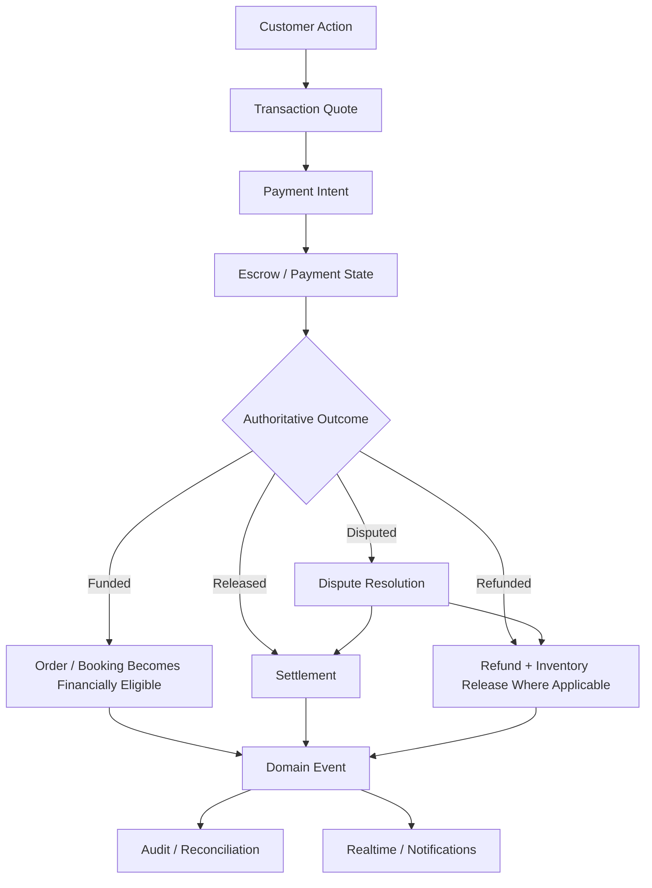

## Escrow funding concurrency

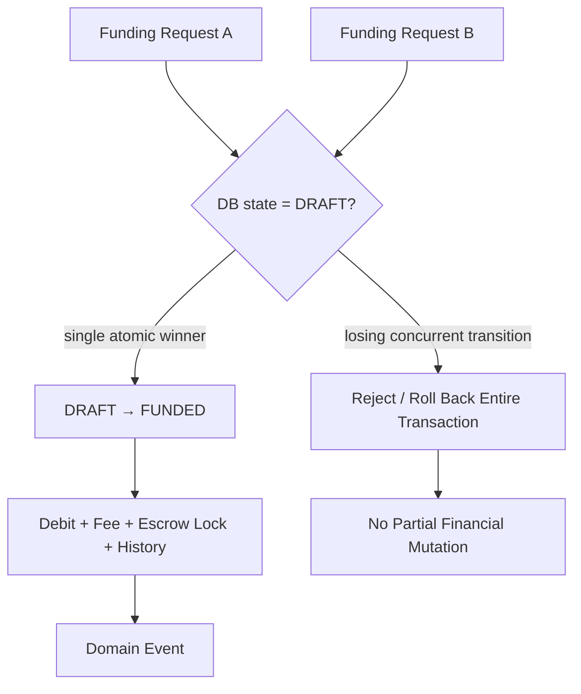

The database transition is the final concurrency boundary; service checks remain responsible for authorization and financial validation.

## Order lifecycle

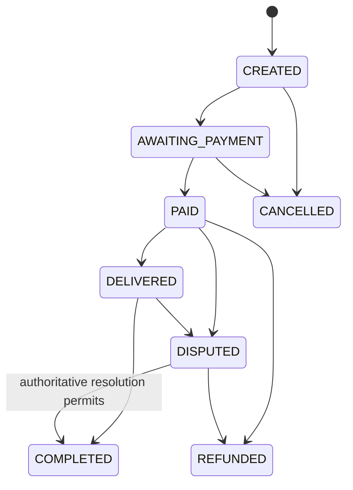

## Inventory lifecycle

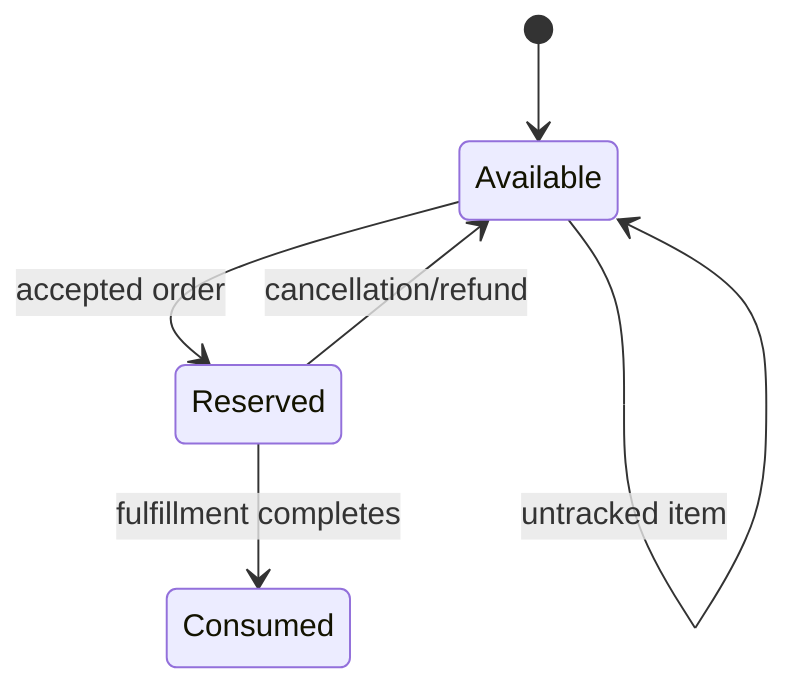

## Reconciliation boundary

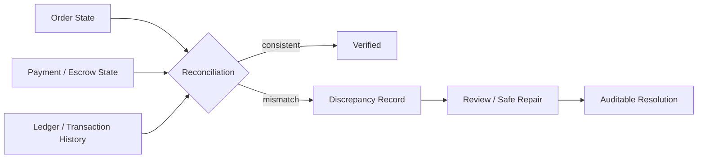

Reconciliation observes authoritative sources; it must not silently rewrite financial history.

## Notifications and realtime

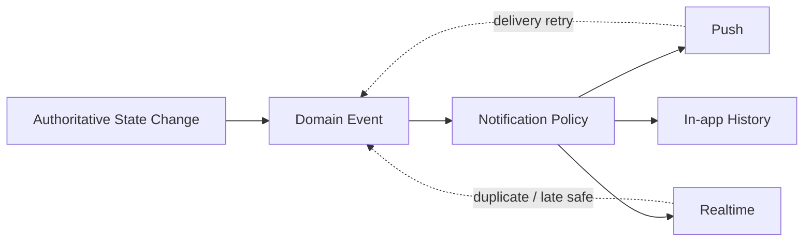

## Social-to-commerce loop

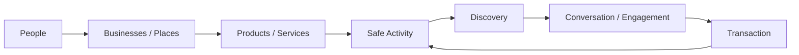

The loop is intentionally constrained: sensitive payment instruments, balances, private transaction metadata and other protected financial details do not become public social activity.

## Agent reading order

1. Start with `README.md` for the master architecture.
2. Use the relevant repository plan for implementation state and detailed flows.
3. Use this file when a visual architecture map provides faster orientation.
4. Treat diagrams as explanatory views, not independent sources of implementation truth.
5. When implementation materially changes a depicted flow, update this map and the affected repository plan in the same coherent batch.
6. Record newly discovered risks and unresolved questions rather than silently deleting them.
