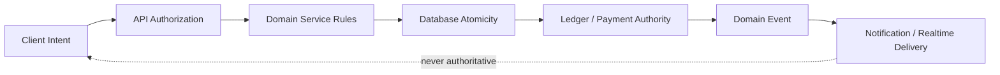
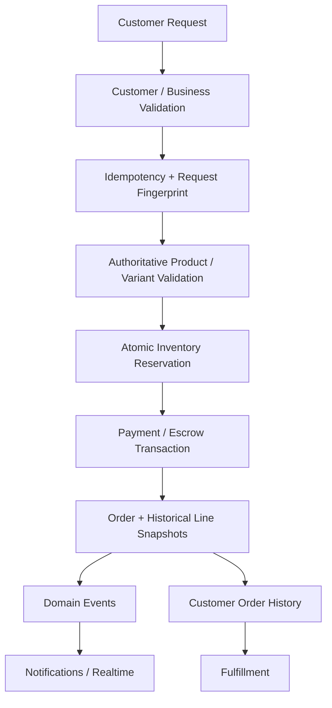
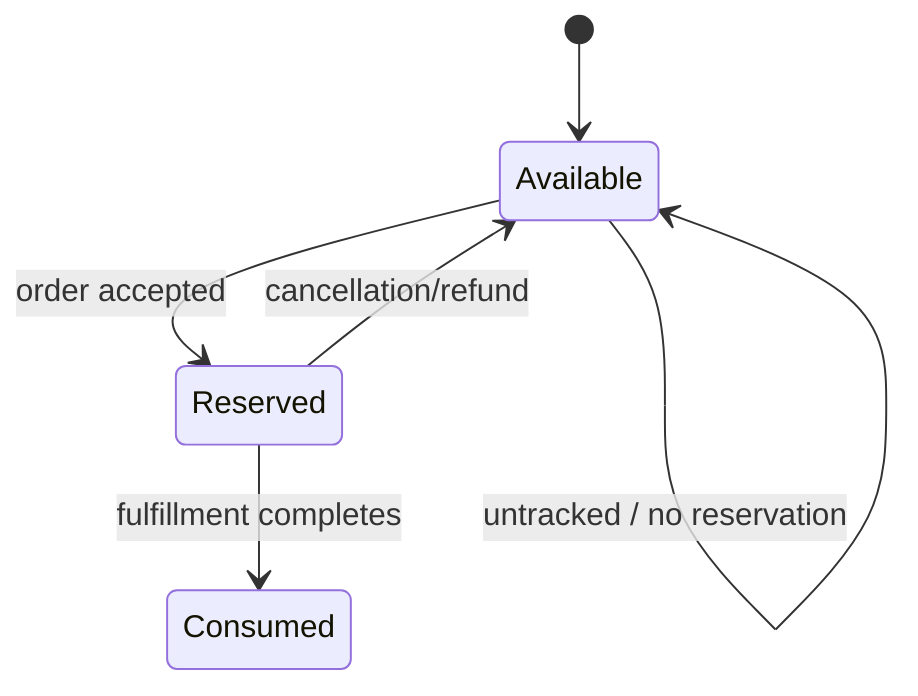
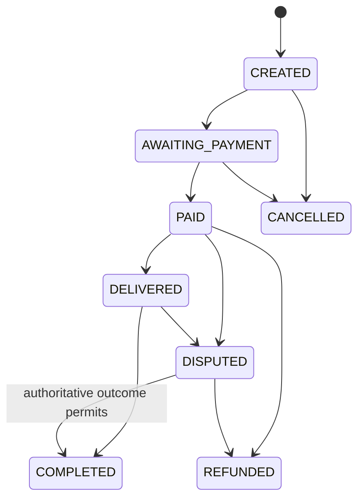
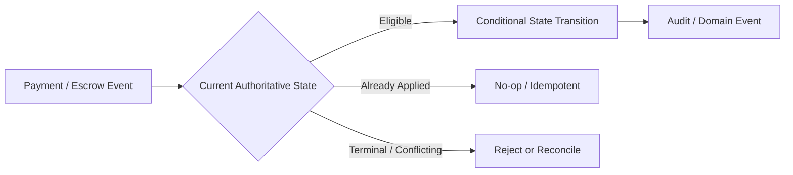
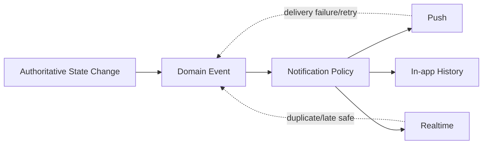
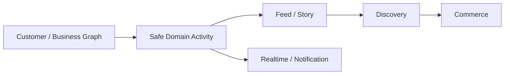

# Pyrax's Backend Plan

**Repository:** `AzamanLTD/AZM-backend`  
**Status:** IN PROGRESS / PARTIALLY COMPLETE  
**Last updated:** 2026-08-30 (UTC)

## Mission

The backend is the authoritative platform boundary for identity, authorization, domain state, money, inventory, orders, notifications, realtime events and reconciliation. Client applications express intent; backend services and database transactions decide truth.

## Authority model

Never trust client-provided price, balance, role, stock, payment state or completion state as authoritative.

## Core architecture

The backend is service-oriented around existing domain services and Prisma-backed persistence. New capabilities must integrate with existing routes/services and API contracts rather than creating duplicate transaction systems.

Critical state transitions must be:

- authorized
- explicit
- idempotent
- concurrency-safe
- auditable
- retry-safe
- reconcilable

Realtime is downstream delivery. It cannot be the source of truth.

## Retail checkout flow

### Checkout integrity implemented

- Idempotency is scoped to the appropriate customer/business context.
- Request fingerprints prevent reuse of one key for a different logical request.
- Concurrent duplicate submissions are handled safely.
- Variant definitions are validated server-side.
- Variant selections are persisted as historical snapshots.
- Multi-item order history returns complete line state.
- Malformed client-success responses do not become false financial success.

## Inventory

Tracked inventory must be reserved atomically with order creation. Concurrent orders must not oversell stock. Cancellation/refund paths release outstanding reservations exactly once. Untracked inventory (`NULL`/unmanaged semantics) must remain unaffected.

Deployment currently uses Prisma schema application mechanisms that require special care. Runtime convergence/readiness logic and migrations must agree; a migration alone is insufficient if deployment can recreate an old constraint.

## Order state machine

The exact legal transitions must remain explicit. Important rules:

- illegal transitions are rejected;
- terminal states cannot be resurrected by stale events;
- duplicate events are harmless;
- concurrent transitions use conditional/atomic writes;
- dispute resolution can return an eligible order to completion when the authoritative financial outcome permits it;
- escrow events cannot regress refunded/terminal state.

## Payments and escrow

The existing transaction/escrow subsystem remains the financial authority. Storefront checkout must not duplicate ledger behavior. Payment events may arrive late or repeatedly; state transitions must be conditional and idempotent.

Required future hardening:

- complete payment state-machine inventory;
- webhook/event signature and replay review;
- refund idempotency;
- reconciliation jobs and discrepancy reporting;
- immutable audit trail for critical financial transitions;
- explicit relationship between order state and ledger/escrow state.

## Orders and history

Customer and merchant access must be isolated. Pagination must use deterministic ordering. Malformed/reversed date filters are rejected. Historical variants and prices must remain stable after catalog changes.

## Notifications/events

Notifications must never be the mechanism that commits business state. Delivery failures or duplicates must not corrupt the underlying transaction.

## Social foundations

Existing business-follow and social/feed concepts are present. The intended convergence is:

Private financial information must never become social activity accidentally.

## Current status

### VERIFIED / IMPLEMENTED

- Customer/business-scoped checkout idempotency.
- Request fingerprint protection.
- Concurrent duplicate checkout handling.
- Server-side variant validation and historical snapshots.
- Complete order-line retrieval.
- Atomic inventory reservation/release foundations.
- Conditional delivery state transition.
- Escrow event protection against stale regression.
- Deterministic order/notification pagination.
- Dispute-resolution lifecycle coverage.
- Backend CI/test suite has passed the current integrity batch.

### IN PROGRESS

- Full payment/escrow state-machine audit.
- Refund and reconciliation design.
- Inventory edge-case review across non-storefront order creation paths.
- Event/realtime ordering and replay review.
- Auditability and observability hardening.

### PLANNED

- Unified financial event/audit model.
- Reconciliation tooling.
- Cross-vertical payment/booking primitives.
- Social activity event contracts.
- Hotel/transit/restaurant domain services built on shared foundations.

## Risks

- Database triggers or schema convergence can affect legacy order creation paths.
- Payment state can diverge from order state without reconciliation.
- Late webhooks/events can regress state if every transition is not conditional.
- Expanding verticals can duplicate money primitives unless the shared boundary is enforced.

## Verification

Database/schema application, Prisma generation, unit/integration tests, concurrency tests and relevant contract tests are required for meaningful backend batches. Expensive CI should be run after a coherent batch. Financial changes require explicit review of retries, concurrency, authorization and reconciliation—not just happy-path tests.

## Agent continuation rules

1. Read this file before backend architectural changes.
2. Trace route → controller → service → transaction → model → event callers before editing.
3. Search for all callers of a changed service/state transition.
4. Treat money, inventory and authorization as fail-closed boundaries.
5. Prefer atomic/conditional database operations for contested state.
6. Never make realtime/push authoritative.
7. Record status only from evidence.
8. Update this plan after substantial work.
9. Accumulate coherent changes before expensive CI.
10. Never remove historical decisions merely to shorten this document.
