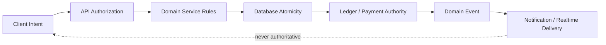
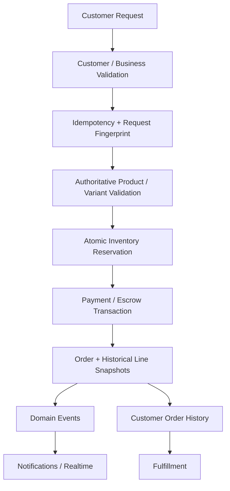
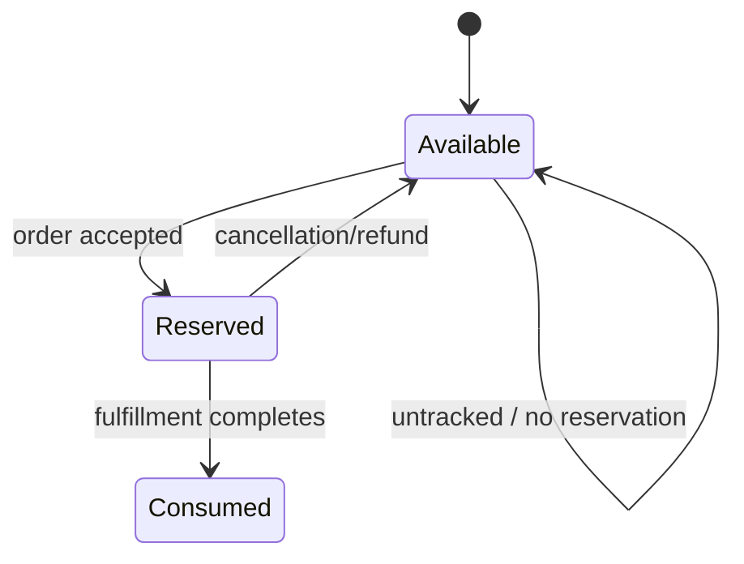
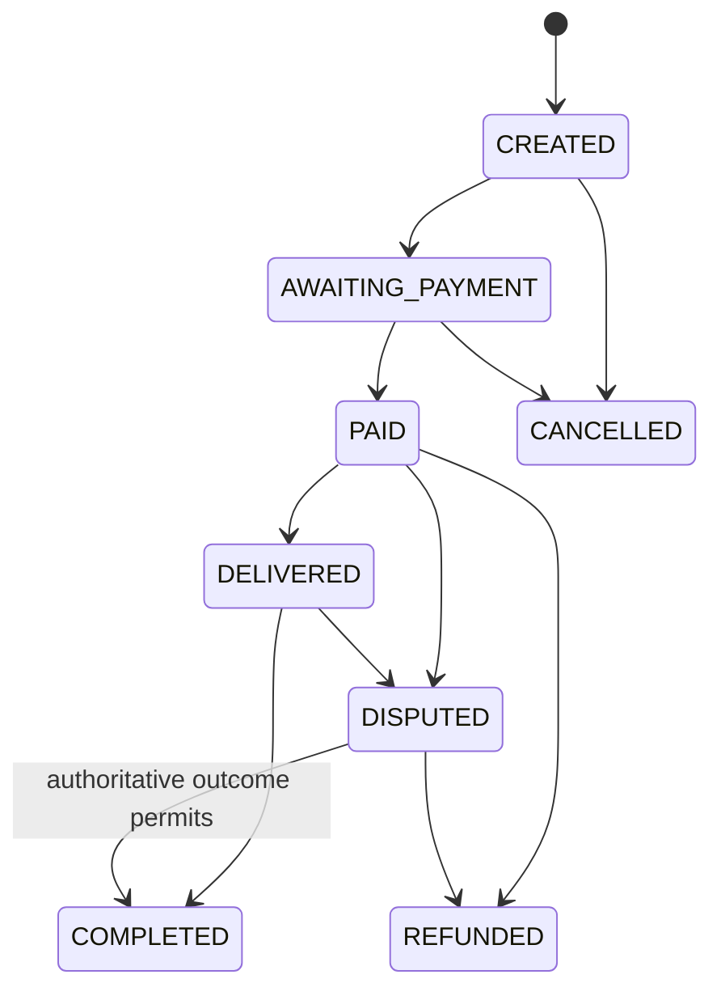
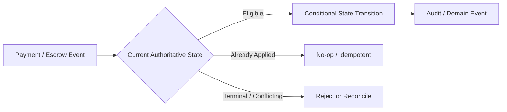
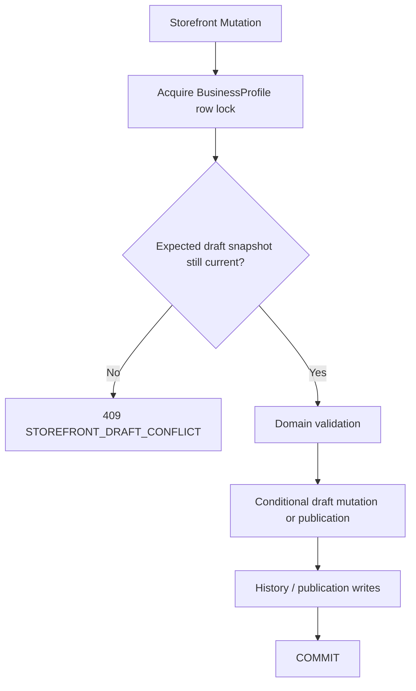
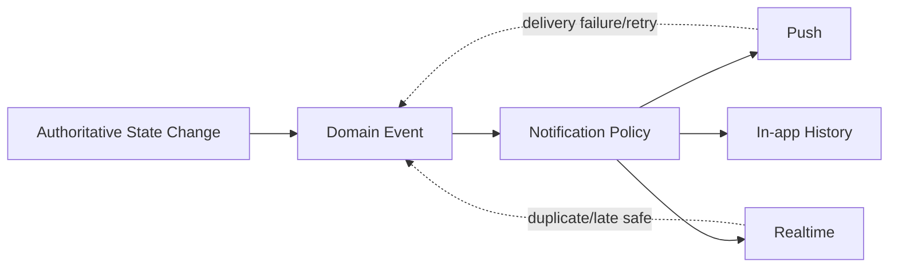
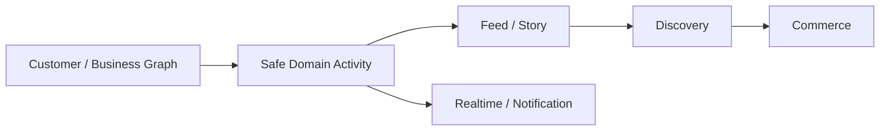
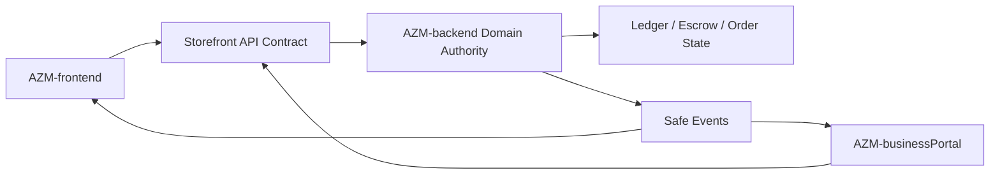

# Pyrax's Backend Plan

**Repository:** `AzamanLTD/AZM-backend`  
**Status:** IN PROGRESS / PARTIALLY COMPLETE  
**Last updated:** 2026-08-30 (UTC) — large engineering batch active

## Mission

The backend is the authoritative platform boundary for identity, authorization, domain state, money, inventory, orders, notifications, realtime events and reconciliation. Client applications express intent; backend services and database transactions decide truth.

## Authority model

Never trust client-provided price, balance, role, stock, payment state or completion state as authoritative.

## Core architecture

The backend is service-oriented around existing domain services and Prisma-backed persistence. New capabilities must integrate with existing routes/services and API contracts rather than creating duplicate transaction systems.

Critical state transitions must be:

- authorized
- explicit
- idempotent
- concurrency-safe
- auditable
- retry-safe
- reconcilable

Realtime is downstream delivery. It cannot be the source of truth.

## Retail checkout flow

### Checkout integrity implemented

- Idempotency is scoped to the appropriate customer/business context.
- Request fingerprints prevent reuse of one key for a different logical request.
- Concurrent duplicate submissions are handled safely.
- Variant definitions are validated server-side.
- Variant selections are persisted as historical snapshots.
- Multi-item order history returns complete line state.
- Malformed client-success responses do not become false financial success.

## Inventory

Tracked inventory must be reserved atomically with order creation. Concurrent orders must not oversell stock. Cancellation/refund paths release outstanding reservations exactly once. Untracked inventory (`NULL`/unmanaged semantics) must remain unaffected.

Deployment currently uses Prisma schema application mechanisms that require special care. Runtime convergence/readiness logic and migrations must agree; a migration alone is insufficient if deployment can recreate an old constraint.

## Order state machine

The exact legal transitions must remain explicit. Important rules:

- illegal transitions are rejected;
- terminal states cannot be resurrected by stale events;
- duplicate events are harmless;
- concurrent transitions use conditional/atomic writes;
- dispute resolution can return an eligible order to completion when the authoritative financial outcome permits it;
- escrow events cannot regress refunded/terminal state.

## Payments and escrow

The existing transaction/escrow subsystem remains the financial authority. Storefront checkout must not duplicate ledger behavior. Payment events may arrive late or repeatedly; state transitions must be conditional and idempotent.

### Escrow funding concurrency guard — added in current batch

A service-level pre-read of `DRAFT` is not sufficient to guarantee single funding under concurrent requests. The current batch adds a PostgreSQL trigger migration that makes `DRAFT → FUNDED` a database-enforced transition boundary. Because funding balance mutations, fee accounting and transaction history occur in the same database transaction, a competing transition that loses the database state race causes its complete financial transaction to roll back rather than merely failing after a debit.

This complements the existing service-level conditional guards used for settlement/refund/cancellation; it does not replace authorization or the service's financial validation.

Required verification before merge:

- apply migration against the CI database;
- exercise concurrent funding requests;
- verify exactly one funding transaction/history row and one balance movement;
- verify the losing request leaves no fee, lock, debit or status mutation behind;
- verify normal non-concurrent funding remains unchanged;
- verify deployment's schema-convergence mechanism preserves the trigger.

## Storefront authoritative-state hardening — current batch

The storefront now has an explicit atomic boundary at the route layer rather than relying on the legacy service's read/check/write behavior.

### Implemented on `feat/storefront-commerce-convergence`

- Added `services/storefrontAtomicService.js` as the authoritative transaction boundary for save, revert, template application and publish.
- The boundary acquires a PostgreSQL `FOR UPDATE` lock on the owning `BusinessProfile` before reading/writing storefront state.
- Draft conflicts now return HTTP 409 with `STOREFRONT_DRAFT_CONFLICT` instead of a generic 400.
- Publication's multi-step history/layout transition executes inside one Prisma transaction.
- Version allocation is serialized by the business-profile row lock, eliminating concurrent `MAX(version)+1` races among these authoritative mutation paths without changing existing history semantics.
- Extended validation contracts so revert/template mutations can carry the same `expectedUpdatedAt` concurrency identity.
- Added backend regression tests for transaction use, row locking, conflict behavior and sequential publication version allocation.
- Updated `storefrontRoutes.js` so draft save, publish, revert and template operations use the atomic service.

### Verification status

**IMPLEMENTED / NOT YET VERIFIED BY CI.** The code has been written and inspected through GitHub's authoritative branch/blob APIs. CI has not yet been run for this accumulated batch.

### Important remaining hardening

- The legacy `storefrontService` functions remain callable internally and should eventually be made private/deprecated so no alternate caller can bypass the atomic boundary.
- `getOrCreateDraft()` can still encounter first-creation races and should eventually use the same business-profile lock boundary.
- Version uniqueness is serialized by the authoritative service lock; a future database uniqueness constraint should be considered only after checking existing production history for duplicates and planning a non-destructive migration.
- Nitro tier thresholds are duplicated between `checkEligibility()` and the validation path and should converge on one authoritative tier resolver.
- Analytics currently loads the entire date-range event set into application memory and should later move toward database aggregation/time-window limits.

## Orders and history

Customer and merchant access must be isolated. Pagination must use deterministic ordering. Malformed/reversed date filters are rejected. Historical variants and prices must remain stable after catalog changes.

## Notifications/events

Notifications must never be the mechanism that commits business state. Delivery failures or duplicates must not corrupt the underlying transaction.

## Social foundations

Existing business-follow and social/feed concepts are present. The intended convergence is:

## Cross-repository contract direction

The frontend now carries the draft `updatedAt` snapshot into publish and recognizes the backend's typed conflict response. Business-portal integration remains part of the later cross-portal hookup pass.

## Agent continuation rules

1. Read this file before changing backend architecture.
2. Inspect the actual route/service/schema/test chain before adding code.
3. Prefer existing primitives and authoritative domain services.
4. Never duplicate financial accounting inside storefront/order presentation code.
5. Critical state transitions must be atomic and concurrency-safe.
6. Record every substantial completed change here with status and rationale.
7. Never mark a change VERIFIED without actual CI/test evidence.
8. Keep the accumulated research as architectural guidance, not as a substitute for implementation.
9. When GitHub code search or file retrieval returns 404/truncation, use repository contents/tree/blob APIs before concluding the resource is absent.
10. Do meaningful engineering batches before expensive CI, then use CI as a verification boundary.
11. Keep Planning synchronized so another agent can reconstruct the work without reading every PR or commit.
