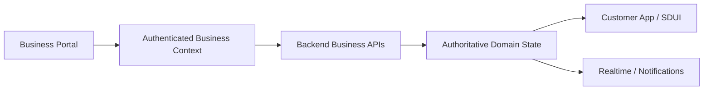
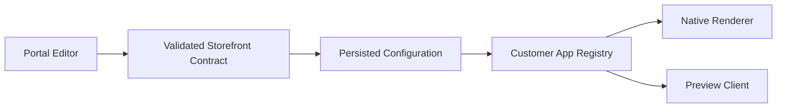
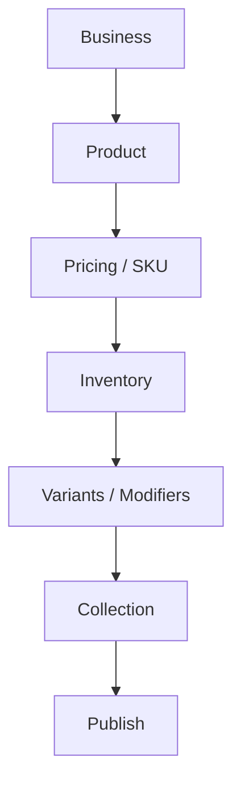
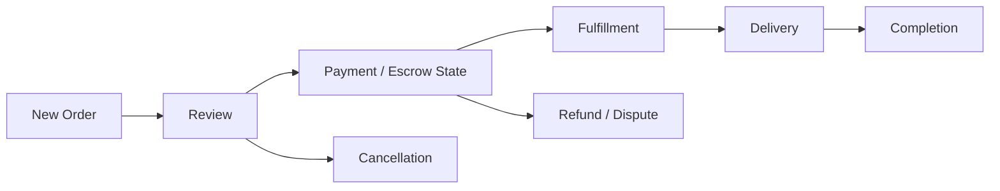
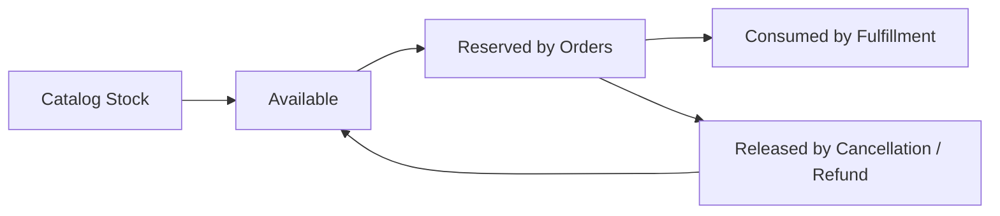
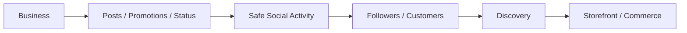

# Pyrax's Business Portal Plan

**Repository:** `AzamanLTD/AZM-businessPortal`  
**Status:** IN PROGRESS / ARCHITECTURE MAPPING  
**Last updated:** 2026-08-30 (UTC)

## Mission

The Business Portal is the merchant operating system. It should let businesses configure their identity, storefront, products, inventory, staff, orders, fulfillment, payments and customer-facing experiences without bypassing backend authority.

## Master role

The Portal is an operator surface, not a second source of truth. It may configure and initiate actions, but financial, authorization, inventory and order decisions remain server-side.

## Storefront architecture

The Portal is intended to configure the normalized storefront contract consumed by the customer Flutter renderer. It should not encode Flutter-specific executable behavior into content.

## Commerce flows

### Catalog

`business → product → pricing/SKU → inventory → variants/modifiers → storefront collection → publish`

### Order operations

Cancellation, refund and dispute operations must follow backend state-machine rules and never be implemented as local UI-only mutations.

### Inventory

Portal stock changes must respect reservation state. Operators must be able to understand available versus reserved stock rather than overwriting quantities blindly.

## Financial operations

Business users may initiate supported operational actions, but payment/escrow/ledger state is authoritative in the backend. The Portal should show clear status and recovery paths rather than claiming money movement from an optimistic UI result.

Future Portal financial UX should include transaction references, settlement state, refunds, discrepancies and reconciliation views appropriate to the business role.

## Realtime

The Portal can receive order/payment/inventory notifications through realtime channels, but should reconcile critical changes with authoritative API state after reconnect or suspicious event ordering.

## Social/customer relationship

Business follows, reviews, social activity and customer interactions should become discoverable platform primitives. Portal controls should let merchants participate in the social graph without exposing private customer financial data.

Potential future capabilities:

- business posts/activity
- promotions as social/discovery events
- review responses
- follower engagement
- live business status
- customer/community interaction
- shareable storefront experiences.

## Current status

### VERIFIED / KNOWN

- Business/customer follow foundations exist in the backend ecosystem.
- Storefront/SDUI concepts already expose business-facing configurable surfaces.
- Retail order/checkout integrity is being hardened in backend and customer frontend.

### IN PROGRESS

- Mapping Portal storefront editor/configuration to the canonical storefront contract.
- Mapping merchant order operations to backend order state transitions.
- Mapping inventory/product/variant administration to the authoritative backend model.

### PLANNED

- Unified merchant command center.
- Inventory reservation visibility.
- Payment/escrow/reconciliation dashboard.
- Fulfillment operations.
- Social/community management.
- Rich storefront preview using the same contract as the customer renderer.
- Analytics and business intelligence.

## Security

Every business operation must establish business identity and authorization server-side. Never trust a business ID supplied only by client UI state. Sensitive financial/customer information must be role-scoped.

## Performance

Large catalogs, orders and analytics must use pagination/lazy loading. Realtime subscriptions must be disposed with the relevant business context. Editors should avoid causing whole-application rebuilds for localized changes.

## Verification

Portal work must be verified against backend authorization and contract behavior, not merely UI snapshots. Any change to a shared storefront contract requires customer-renderer compatibility review.

## Agent continuation rules

1. Read this file before Portal architecture changes.
2. Trace Portal UI → API client → backend route/service before changing behavior.
3. Treat the backend as authoritative for money, permissions, inventory and order state.
4. Reuse the canonical storefront contract.
5. Do not create Portal-only versions of customer domain models without a documented reason.
6. Record implementation and verification status here after substantial work.
7. Accumulate meaningful work before expensive verification.
