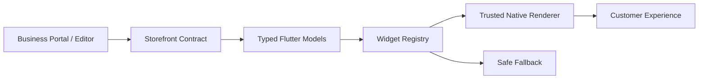
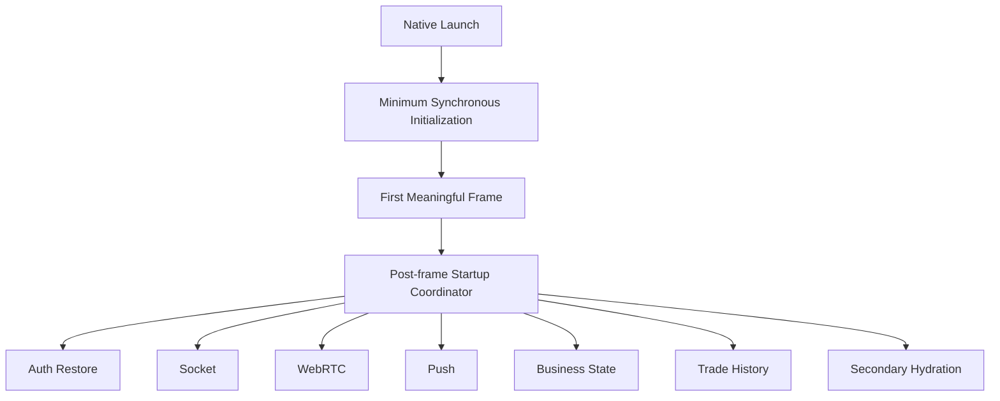
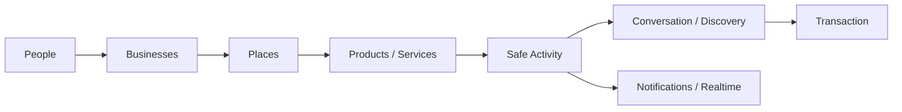

# Pyrax's Frontend Plan

**Repository:** `AzamanLTD/AZM-frontend`  
**Status:** IN PROGRESS / PARTIALLY COMPLETE  
**Last updated:** 2026-08-30 (UTC)

## Mission

The customer application is the immersive AZM experience: discovery, commerce, social interaction, communication, payments and future vertical journeys. It should feel unified even though domain capabilities are modular.

## Architecture

Flutter is organized around shared services, domain experiences and a server-driven storefront layer. The storefront flow is:

`Portal/editor → Storefront contract → typed Flutter models → widget registry → trusted native renderer`

The server supplies declarative data, never arbitrary executable UI. Unknown widget types must degrade safely. Shared primitives should be reused across retail, hotel, transit and restaurant rather than creating separate rendering stacks.

### Major layers

- App/bootstrap and lifecycle
- Authentication and identity
- Navigation/shell
- Storefront/SDUI
- Commerce/cart/checkout
- Orders and customer history
- Payments/escrow-facing UX
- Realtime sockets/WebRTC
- Notifications
- Social/discovery
- Media/image performance
- Shared networking and error handling

## Startup architecture

The application should render the first meaningful frame with minimum synchronous work. Non-critical initialization is coordinated after the first frame. Current target sequence:

Navigation should lazily mount expensive tabs while preserving state where required. Startup and frame performance must be measured on physical devices/profile builds.

## Retail flow

```mermaid
flowchart LR
    A[SDUI Storefront] --> B[Collection / Product]
    B --> C[Quick Look]
    C --> D[Variants / Modifiers]
    D --> E[Cart]
    E --> F[Checkout Controller]
    F --> G[Storefront Gateway]
    G --> H[StorefrontService]
    H --> I[Backend Checkout]
    I --> J[Order]
    J --> K[Order History]
    K --> L[Fulfillment]
```

### Cart invariants

- Variant combinations have collision-safe canonical identities.
- Async checkout uses a snapshot of the submitted cart.
- Successful checkout removes only the quantities represented by that snapshot.
- New items added while checkout is in flight must survive.
- Idempotency keys/fingerprints are reused only for the same logical attempt.
- Cart mutation invalidates stale checkout identity.

### Checkout error policy

- Validation/business errors (`4xx` except retry-oriented cases) stop automatic retry.
- `408`, `429`, and `5xx` remain retry candidates.
- Network and malformed-success failures remain recoverable.
- A client success message is never treated as proof of financial settlement.

## Storefront/SDUI

Existing widget families include hero/header, products, collections, reviews, promotions, contact/location, media/video, live statistics, social feed and actions. The registry is the extension point. Do not create one-off storefront screens when an existing contract/registry primitive can express the experience.

The social feed widget is currently a presentation seam rather than a mature activity system. It must eventually consume a privacy-safe AZM-native activity model.

## Social direction

The long-term graph is:

`people → businesses → places → products/services → activity → conversation → discovery → transaction`

Customer financial details, balances, payment instruments and sensitive transaction metadata must never leak into public social activity. Social activity should be derived from safe domain events.

## Realtime

Sockets/WebRTC/push are delivery mechanisms, not authoritative state. Events must tolerate duplication, delay and reordering. Critical state should reconcile against API truth.

## Current implementation

### VERIFIED / IMPLEMENTED

- Retail variant selection and validation in quick-look UI.
- Collision-safe cart variant identities.
- Checkout idempotency propagation.
- Cart snapshot semantics.
- Safe partial cart clearing after successful checkout.
- Typed checkout HTTP exception handling.
- Retry classification for transient versus non-retryable server failures.
- Payment-mode mapping and gateway tests.
- Malformed-success regression handling.
- Existing Flutter quality gates have passed in recent verification.

### IN PROGRESS

- Startup orchestration and post-first-frame hydration.
- Navigation rebuild/lazy-mount optimization.
- Rendering/image audit.
- Deeper storefront/social architecture convergence.
- Cross-vertical shared primitive mapping.

### PLANNED

- Mature native social activity/feed model.
- Unified order/payment state presentation.
- Offline/reconnect reconciliation where appropriate.
- Richer transaction progress and recovery UX.
- Hotel, transit and restaurant journeys built on shared foundations.

## Known risks

- Realtime events can become stale if treated as truth.
- Rich media can regress frame time or memory.
- Adding vertical-specific widgets can fragment the SDUI architecture.
- Financial UX must never imply settlement before authoritative confirmation.

## Verification

Run analyzer/tests/coverage for meaningful frontend batches. Android/integration verification is expensive and should be run at batch boundaries, not after every micro-change. Review changed flows against existing services and models before verification.

## Agent continuation rules

1. Read this file before changing frontend architecture.
2. Inspect the existing service/model/widget/caller chain before adding code.
3. Prefer existing primitives and contracts.
4. Record every substantial completed change here with status and rationale.
5. Never mark a change VERIFIED without actual verification evidence.
6. Update risks and next steps when discoveries change the architecture.
7. Keep financial authority server-side.
8. Accumulate meaningful work before expensive CI.
