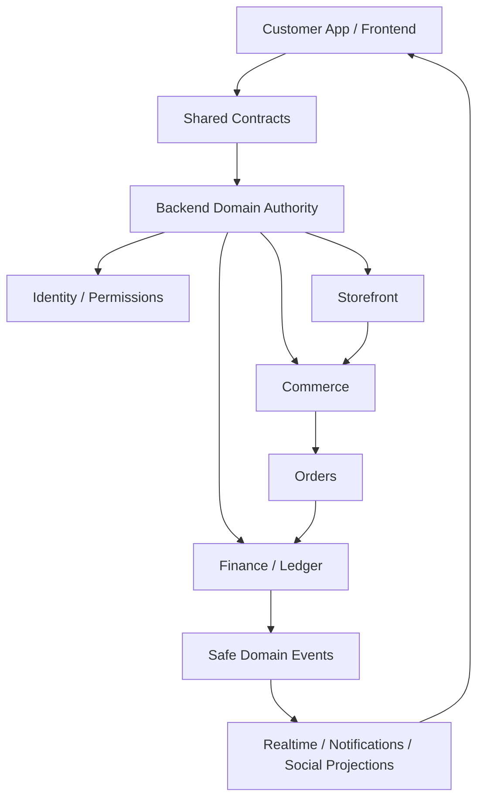
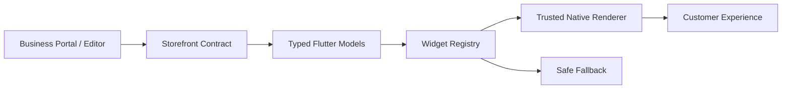
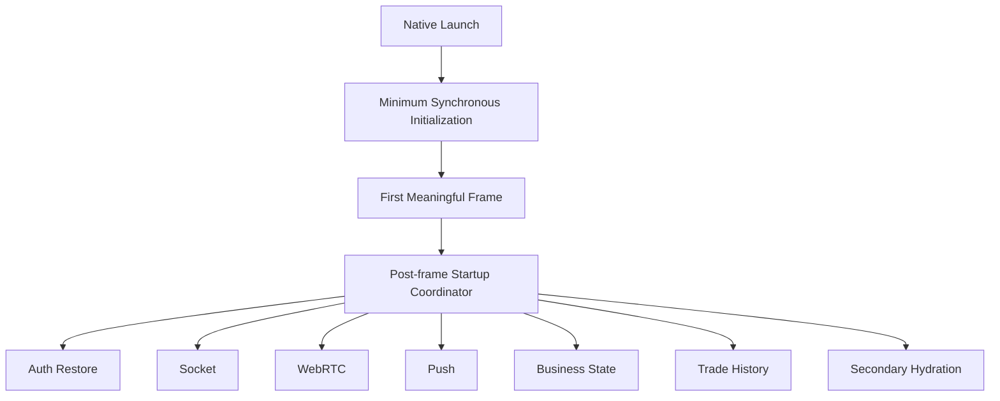
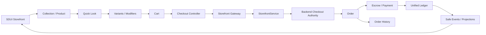
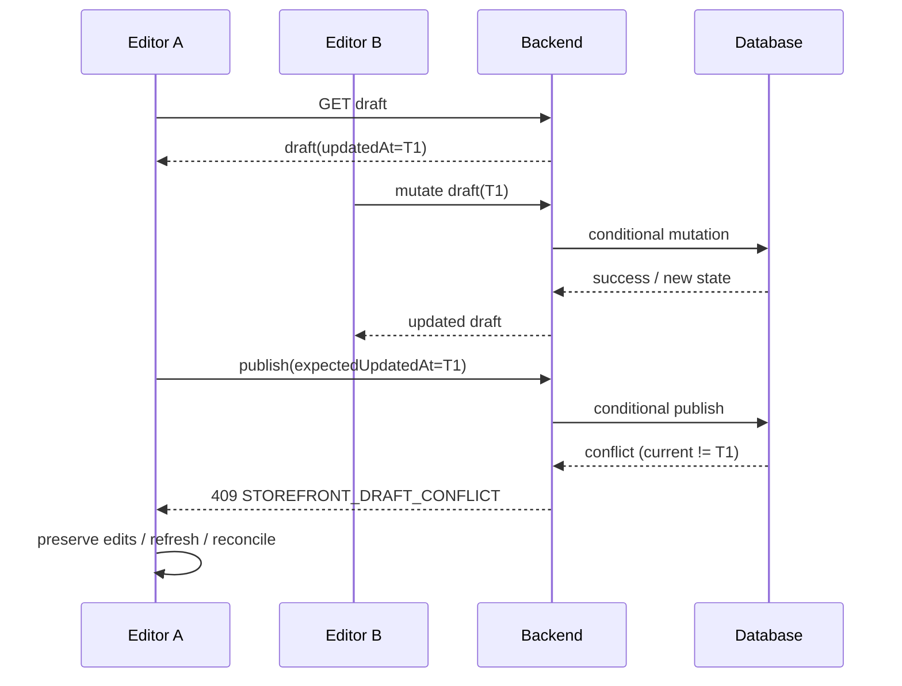
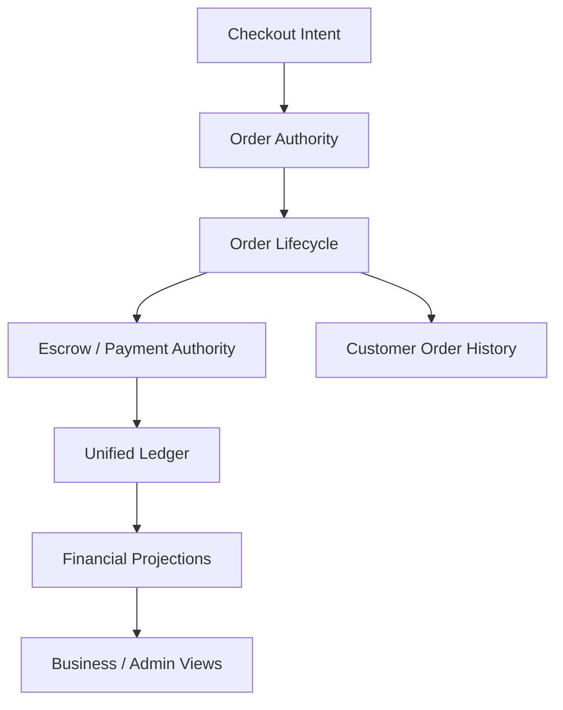
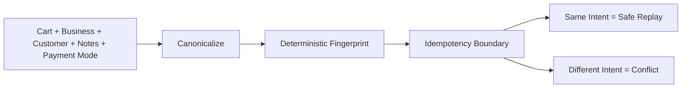
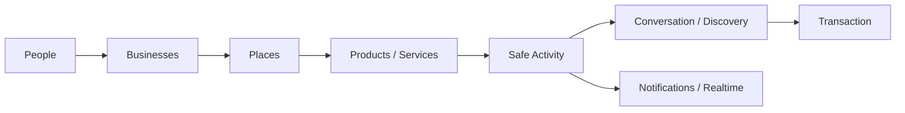

# Pyrax's Frontend Plan

**Repository:** `AzamanLTD/AZM-frontend`  
**Status:** IN PROGRESS / PARTIALLY COMPLETE  
**Last updated:** 2026-08-30 (UTC)  
**Purpose:** Living architecture + engineering record. This file is the readable brain for frontend work; it is not a substitute for tests, code review, or CI evidence.

## Mission

The customer application is the immersive AZM experience: discovery, commerce, social interaction, communication, payments and future vertical journeys. It should feel unified even though domain capabilities are modular.

## Master architecture



The frontend is a consumer of authoritative domain state. It must not become a second source of truth for money, inventory, order settlement, escrow, permissions, or publication state.

## Architecture principles

1. **One source of truth per domain rule.** Shared policy belongs in the authoritative domain/backend layer; clients consume the result.
2. **Database/domain authority beats client timing.** Client timestamps/revisions express expectations; the backend decides whether those expectations remain valid.
3. **Transactions are authoritative state transitions.** Cache invalidation, analytics and realtime happen after successful authoritative mutations.
4. **Idempotency represents economic intent.** Equivalent logical checkout retries should converge; materially different economic intent must not reuse an operation identity.
5. **Realtime is delivery, not truth.** Events can duplicate, reorder or arrive late. Critical state reconciles against API truth.
6. **Financial UX must never imply settlement before authoritative confirmation.** A successful HTTP request is not itself proof of ledger settlement.
7. **Server-driven UI is declarative.** The server supplies trusted data/configuration; it does not deliver arbitrary executable UI.
8. **Shared vertical primitives must remain reusable.** Retail, hotel, transit and restaurant journeys should extend common foundations instead of fragmenting into separate stacks.

## Storefront / SDUI

Flutter is organized around shared services, domain experiences and a server-driven storefront layer.



Unknown widget types must degrade safely. Existing widget families include hero/header, products, collections, reviews, promotions, contact/location, media/video, live statistics, social feed and actions. The registry is the extension point.

## Startup architecture

The application should render the first meaningful frame with minimum synchronous work. Non-critical initialization is coordinated after the first frame.



Navigation should lazily mount expensive tabs while preserving state where required. Startup and frame performance must be measured on physical devices/profile builds.

## Retail architecture



### Cart invariants

- Variant combinations have collision-safe canonical identities.
- Async checkout uses a snapshot of the submitted cart.
- Successful checkout removes only the quantities represented by that snapshot.
- New items added while checkout is in flight must survive.
- Idempotency keys/fingerprints are reused only for the same logical attempt.
- Cart mutation invalidates stale checkout identity.
- Client state never substitutes for authoritative inventory or payment state.

### Checkout error policy

- Validation/business errors (`4xx` except retry-oriented cases) stop automatic retry.
- `408`, `429`, and `5xx` remain retry candidates.
- Network and malformed-success failures remain recoverable.
- A client success message is never treated as proof of financial settlement.
- Idempotency conflicts must be surfaced as domain outcomes, not blindly retried.

## Storefront draft concurrency

The frontend now preserves the draft's loaded `updatedAt` through publish. The backend contract is being hardened to make this an authoritative optimistic-concurrency boundary.



**Rule:** a stale draft is not a transient network error. The client must not automatically retry a stale publish with the same stale token.

### Frontend implementation state

- `StorefrontService.publish()` accepts `expectedUpdatedAt` and sends it to the backend.
- The draft provider forwards the currently loaded draft timestamp into publish.
- `StorefrontConflictException` preserves the domain-specific 409 outcome.
- Draft provider state exposes a conflict condition instead of collapsing it into an ordinary failure.
- Save/revert/template paths are being aligned with the same concurrency identity.

These are **implemented but not CI-verified** for the current convergence batch.

## Backend/domain convergence requirements

The frontend contract assumes these backend guarantees:

```text
client expectation
      ↓
conditional domain mutation
      ↓
authoritative database transaction
      ↓
committed state
      ↓
cache / analytics / realtime projections
```

The backend storefront implementation is being hardened so:

- draft mutations are concurrency-aware;
- publication is one authoritative transaction;
- publication history version allocation cannot race between concurrent publishers;
- revert/template mutations cannot silently overwrite a newer draft;
- first-draft creation is safe under concurrent requests.

The frontend must not claim these guarantees are complete until CI and integration evidence confirm them.

## Order / commerce convergence

The wider commerce architecture includes a dedicated order lifecycle authority and separate financial authority. `BusinessOrder` tracks order state; escrow/ledger services own financial movement.



Recent backend work also adds conditional order transitions so a concurrent state change is not blindly overwritten. This is part of the same invariant: **state transitions should be conditional on the state the caller actually observed.**

## Idempotency / economic identity

Checkout identity is based on canonical economic intent rather than raw request serialization.



Equivalent item ordering must not create different fingerprints. Quantity, payment mode or other material economic changes must create a different fingerprint.

## Social direction



The long-term graph is:

`people → businesses → places → products/services → activity → conversation → discovery → transaction`

Customer financial details, balances, payment instruments and sensitive transaction metadata must never leak into public social activity. Social activity should be derived from safe domain events.

## Realtime

Sockets/WebRTC/push are delivery mechanisms, not authoritative state. Events must tolerate duplication, delay and reordering. Critical state should reconcile against API truth.

## Current implementation

### VERIFIED / IMPLEMENTED

- Retail variant selection and validation in quick-look UI.
- Collision-safe cart variant identities.
- Checkout idempotency propagation.
- Cart snapshot semantics.
- Safe partial cart clearing after successful checkout.
- Typed checkout HTTP exception handling.
- Retry classification for transient versus non-retryable server failures.
- Payment-mode mapping and gateway tests.
- Malformed-success regression handling.
- Existing Flutter quality gates have passed in prior verification batches.

### IMPLEMENTED / AWAITING VERIFICATION

- Frontend publish concurrency contract propagation.
- Typed storefront stale-draft conflict exception.
- Provider-level conflict state.
- Backend storefront atomic mutation/concurrency implementation.
- Backend order conditional-transition regression coverage.
- Checkout economic-intent fingerprint regression coverage.

### IN PROGRESS

- Startup orchestration and post-first-frame hydration.
- Navigation rebuild/lazy-mount optimization.
- Rendering/image audit.
- Deeper storefront/social architecture convergence.
- Cross-vertical shared primitive mapping.
- Full frontend/backend contract verification for storefront publication.
- Reconciliation UX for stale draft conflicts.
- Complete checkout → order → escrow → ledger contract verification.

### PLANNED

- Mature native social activity/feed model.
- Unified order/payment state presentation.
- Offline/reconnect reconciliation where appropriate.
- Richer transaction progress and recovery UX.
- Hotel, transit and restaurant journeys built on shared foundations.
- Full business/admin/customer portal hookup verification after authoritative contracts stabilize.

## Known risks / open engineering questions

- GitHub code search is unavailable for AZM-frontend; use repository contents/tree/blob APIs instead of interpreting search 404s as absence.
- Realtime events can become stale if treated as truth.
- Rich media can regress frame time or memory.
- Adding vertical-specific widgets can fragment the SDUI architecture.
- Financial UX must never imply settlement before authoritative confirmation.
- Frontend concurrency propagation is not sufficient without backend conditional-write enforcement.
- Analytics is a projection and should not block authoritative commerce state.
- Nitro eligibility/tier calculations must eventually have one authoritative policy source; duplicated threshold logic is a drift risk.
- Legacy `/order` paths must eventually converge with the same checkout/order/escrow/ledger invariants rather than becoming a parallel commerce system.

## Verification rules

Run analyzer/tests/coverage for meaningful frontend batches. Android/integration verification is expensive and should be run at batch boundaries, not after every micro-change.

Never mark an item VERIFIED based solely on code inspection. Require actual CI/test evidence and record the relevant commit/check result.

## Batch log

### 2026-08-30 — Storefront + commerce convergence batch

**Status:** IN PROGRESS / PARTIALLY COMPLETE

Work accumulated into the current engineering batch:

1. Added checkout economic-intent canonicalization and deterministic SHA-256 fingerprinting.
2. Added regression coverage for canonical intent/idempotency behavior.
3. Propagated `expectedUpdatedAt` from frontend draft state through publish.
4. Added typed storefront conflict handling in the frontend.
5. Added backend storefront concurrency/atomicity work.
6. Added order lifecycle conditional-transition coverage.
7. Added documentation/architecture diagrams for the storefront, commerce, concurrency and social boundaries.
8. Recorded GitHub repository/tree/blob access workarounds so code-search limitations do not discard research.

**Verification status:** code changes are not yet fully CI-verified as one complete cross-repository batch. Do not promote these items to VERIFIED until the relevant workflows complete successfully.

## Agent continuation rules

1. Read this file before changing frontend architecture.
2. Treat this file as the living architecture brain, but verify claims against current code before implementation.
3. Inspect the existing service/model/widget/caller chain before adding code.
4. Prefer existing primitives and contracts.
5. Record every substantial completed change here with status and rationale.
6. Never mark a change VERIFIED without actual verification evidence.
7. Update risks and next steps when discoveries change the architecture.
8. Keep financial authority server-side.
9. Accumulate meaningful work before expensive CI.
10. When GitHub code search is unavailable, use repository contents/tree/blob APIs rather than concluding that a path is absent from a 404.
11. Preserve concurrency identity from loaded draft state through every mutation and publish operation.
12. Do not silently convert domain conflicts into generic transient errors.
13. Do not introduce a second implementation of an existing business policy merely for convenience.
14. Before moving to portal hookup, verify the backend contract and frontend caller together.
15. Carry forward the master architecture: storefront → commerce → order → escrow/payment → ledger → safe projections/realtime/social, with each layer retaining its own authority.
