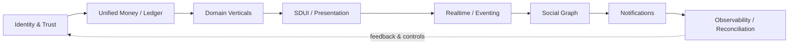
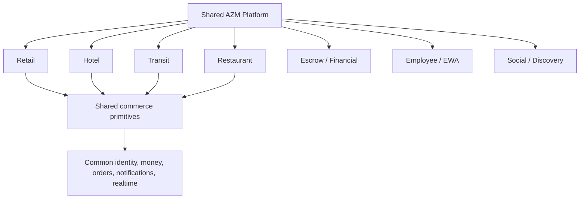

# AZM Planning — Project Brain

**Status:** IN PROGRESS  
**Last updated:** 2026-08-30 (UTC)  
**Purpose:** Central, human-readable engineering memory for the AZM platform.

This repository is the planning source for the product repositories. It intentionally contains planning and architecture documentation only; it is not an application repository.

## Documents

- [Pyrax's frontend plan](Pyrax%27s%20frontend%20plan.md) — customer Flutter application.
- [Pyrax's backend plan](Pyrax%27s%20backend%20plan.md) — APIs, domain services, money, orders, inventory, realtime and trust boundaries.
- [Pyrax's businessPortal plan](Pyrax%27s%20businessPortal%20plan.md) — merchant/business operations and configuration.
- [Pyrax's adminPortal plan](Pyrax%27s%20adminPortal%20plan.md) — platform administration, oversight, risk and operations.
- [Pyrax's planning plan](Pyrax%27s%20planning%20plan.md) — how this repository itself is maintained.

## Master architecture

AZM is being developed as one platform with many vertical experiences. The target backbone is:

**Identity & Trust → Unified Money/Ledger → Domain Verticals → SDUI/Presentation → Realtime/Eventing → Social Graph → Notifications → Observability/Reconciliation**

### Master platform flow

The platform must prefer shared primitives over parallel implementations. Retail is the current deep-hardening vertical and establishes reusable commerce primitives for Hotel, Transit, Restaurant and later financial/employee experiences.

### Vertical expansion model

These diagrams are conceptual architecture maps. The detailed repository plans remain the source of truth for implementation status and exact flows.

## Current master status

- Retail checkout integrity: active hardening.
- Backend order/payment/inventory state integrity: active hardening.
- Customer Flutter startup/performance and navigation: active architectural work.
- Social foundations: existing pieces identified; convergence work remains.
- Portal architecture: existing repositories need continued contract mapping.
- Central planning brain: established in `AZM-Planning`.

## State vocabulary

Every plan must distinguish **PLANNED**, **IN PROGRESS**, **IMPLEMENTED**, **VERIFIED**, **DEFERRED**, and **REJECTED**. Discussion is never evidence of implementation.

## Update discipline

After substantial work, update the relevant plan before declaring the work complete. Record what changed, why, affected flows, files/areas, tests or verification, remaining risk, and the next intended step. Update timestamps. Never erase history to make the project look cleaner.

## Working principle

Do not optimize for tiny isolated changes. First understand the surrounding architecture, callers, data model, state machine, security boundary and existing tests. Then make coherent batches. Expensive CI should be run after a meaningful batch, not after every micro-change.
