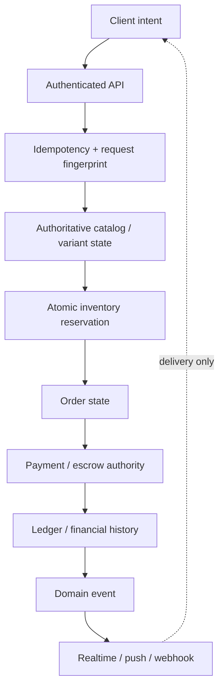
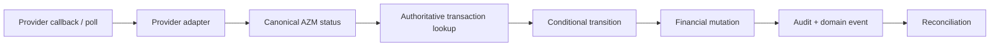
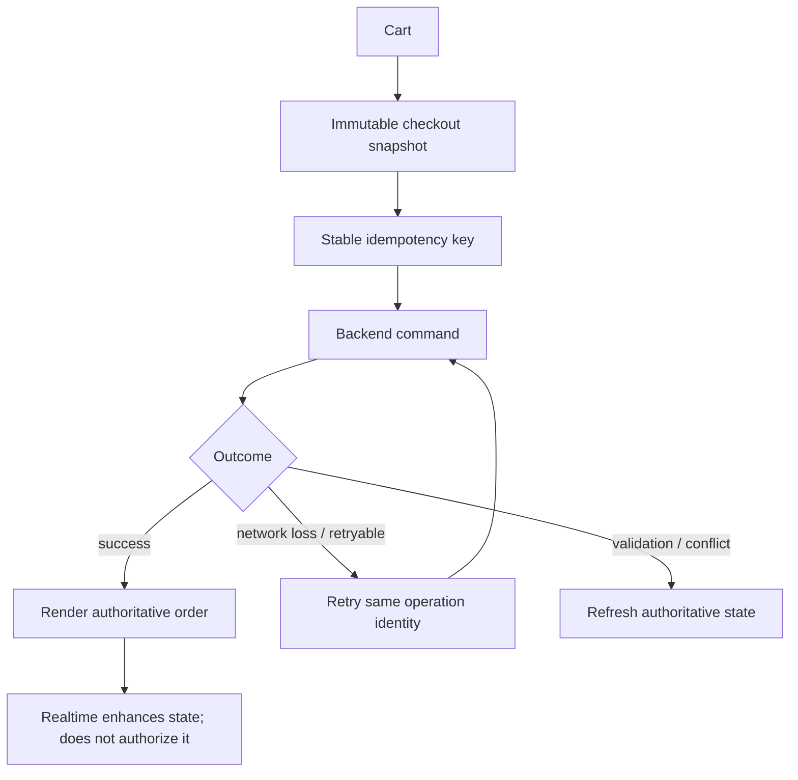

# Checkout Economic Operation — Deep Dive

**Repository scope:** `AzamanLTD/AZM-backend` + storefront/frontend contract  
**Status:** IN PROGRESS  
**Last updated:** 2026-08-30 (UTC)  
**Purpose:** Define and verify the complete failure/retry boundary from storefront intent through order, inventory, payment/escrow and downstream projections.

## Core flow

## Non-negotiable boundaries

- Client UI, caches, realtime messages and notifications are not financial authority.
- Database constraints are final authority for uniqueness.
- Conditional database transitions, not pre-checks, provide concurrency safety.
- Inventory reservation must remain protected at the database boundary.
- Provider callbacks are normalized before entering the canonical financial state machine.
- Worker locks coordinate execution but cannot be the sole financial safety mechanism.
- Order status, payment/escrow status and inventory status are related state machines, not one universal state.

## Failure / recovery matrix

| Boundary | Failure | Required behavior |
|---|---|---|
| Request → idempotency | response lost | same operation identity recovers established result |
| Idempotency | same key, changed request | reject key reuse without mutation |
| Catalog | variant/pricing changed | fail before economic mutation |
| Inventory | insufficient stock | no partial reservation/payment side effect |
| Inventory | concurrent buyers | DB serialization selects one winner |
| Payment initiation | provider timeout | never assume success; remain recoverable |
| Provider callback | duplicate | acknowledge without second mutation |
| Provider callback | late/conflicting | conditional transition; never regress terminal truth |
| Notification | delivery failure | financial outcome remains committed; retry delivery separately |
| Worker | duplicate execution | authoritative transition remains safe |

## Retry semantics

Every mutation must explicitly be classified as:

1. idempotent command;
2. strict transition;
3. safe no-op;
4. new operation.

The classification must be reflected in API/service tests.

## Provider boundary

Provider-specific status codes and references must never become canonical financial semantics.

## Frontend contract to verify later

The eventual frontend pass must verify that optimistic UI never presents payment, stock or completion as authoritative before backend confirmation.

## Verification gate

Before this area becomes VERIFIED, cover at minimum: duplicate checkout, same-key/different-request rejection, last-stock race, inventory rollback, provider timeout + callback, duplicate callback, late terminal callback, lost client response + retry, post-success notification failure, worker retry, and reconciliation of deliberate divergence.

## Current assessment

**Foundations already present:** scoped idempotency/fingerprints, authoritative variant validation, order-line snapshots, atomic inventory foundations, conditional order/escrow transitions, deterministic ordering, dispute lifecycle coverage, provider failover/reconciliation infrastructure.

**Still to implement/prove:** exhaustive checkout failure-boundary tests, producer mapping for `BusinessOrderItem`, provider callback convergence, distributed worker safety, and final frontend/backend contract verification.

## Agent update rules

- Trace callers before changing state transitions.
- Preserve established canonical services; do not create parallel financial authorities.
- Record observed behavior separately from intended architecture.
- Add diagrams where they clarify a real flow; do not decorate every section.
- Update this document whenever an invariant is implemented, disproved, or newly discovered.
- Accumulate coherent engineering work and reserve expensive CI for the end of a significant batch.
