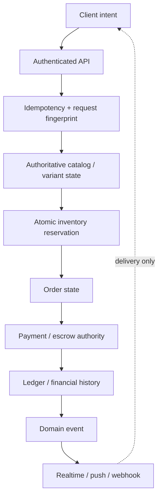
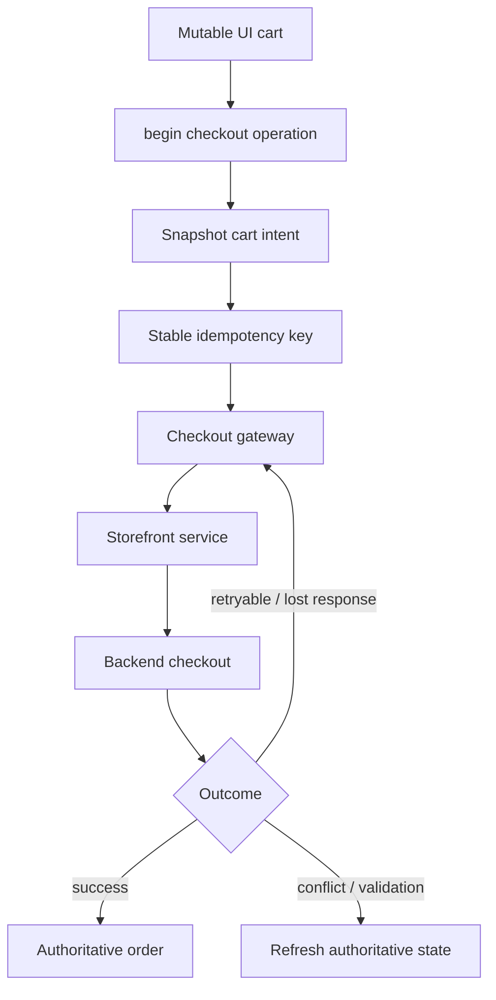
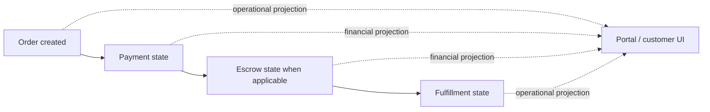

# Checkout Economic Operation — Deep Dive

**Repository scope:** `AzamanLTD/AZM-backend` + storefront/frontend contract  
**Status:** IN PROGRESS  
**Last updated:** 2026-08-30 (UTC)  
**Purpose:** Define and verify the complete failure/retry boundary from storefront intent through order, inventory, payment/escrow and downstream projections.

## Core flow

## Non-negotiable boundaries

- Client UI, caches, realtime messages and notifications are not financial authority.
- Database constraints are final authority for uniqueness.
- Conditional database transitions, not pre-checks, provide concurrency safety.
- Inventory reservation must remain protected at the database boundary.
- Provider callbacks are normalized before entering the canonical financial state machine.
- Worker locks coordinate execution but cannot be the sole financial safety mechanism.
- Order status, payment/escrow status and inventory status are related state machines, not one universal state.

## Failure / recovery matrix

| Boundary | Failure | Required behavior |
|---|---|---|
| Request → idempotency | response lost | same operation identity recovers established result |
| Idempotency | same key, changed request | reject key reuse without mutation |
| Catalog | variant/pricing changed | fail before economic mutation |
| Inventory | insufficient stock | no partial reservation/payment side effect |
| Inventory | concurrent buyers | DB serialization selects one winner |
| Payment initiation | provider timeout | never assume success; remain recoverable |
| Provider callback | duplicate | acknowledge without second mutation |
| Provider callback | late/conflicting | conditional transition; never regress terminal truth |
| Notification | delivery failure | financial outcome remains committed; retry delivery separately |
| Worker | duplicate execution | authoritative transition remains safe |

## Retry semantics

Every mutation must explicitly be classified as:

1. idempotent command;
2. strict transition;
3. safe no-op;
4. new operation.

The classification must be reflected in API/service tests.

## Frontend operation lifecycle — latest verified state

The frontend checkout layer has an explicit `RetailCheckoutOperation` abstraction. The operation owns a stable idempotency key and captures checkout intent from the cart before submission. The controller can accept an existing operation identity for recovery, while the gateway transports the identity to `StorefrontService.checkoutCart()`.

**Invariant:** a retry of the same checkout intent must reuse the same operation identity. A materially changed cart must not be silently submitted under an old operation identity.

The operation implementation defensively snapshots checkout lines and variant maps so later UI-side mutation cannot alter an already-created economic intent.

### Verified vs. open

**Verified:** the frontend service accepts and propagates an idempotency key; the retail checkout layer has an operation abstraction; the operation identity is generated at the operation boundary rather than inside the transport gateway; the backend storefront checkout has an idempotency-key contract and transactional checkout foundations.

**Open:** complete production caller graph; exact backend request-fingerprint canonicalization versus the frontend checkout payload; concurrency behavior for two simultaneous first requests using the same key; and end-to-end lost-response recovery tests.

## Commerce state separation

Order creation, payment confirmation, escrow funding/release, and fulfillment are separate state concerns. They must not be collapsed into a single UI status or treated as interchangeable financial authority.

## Storefront authoring concurrency

The storefront domain also contains draft/publish/revert/template/versioning behavior. Its existing optimistic-concurrency pattern (`expectedUpdatedAt`) is an important platform-wide precedent: stale authors should be rejected rather than silently overwriting newer authoritative state.

A related audit remains open for multi-write publish operations: verify whether archiving/deleting/creating publication/history/draft records are enclosed in one database transaction and add failure-boundary coverage if not.

## Verification gate

Before this area becomes VERIFIED, cover at minimum: duplicate checkout, same-key/different-request rejection, last-stock race, inventory rollback, provider timeout + callback, duplicate callback, late terminal callback, lost client response + retry, post-success notification failure, worker retry, and reconciliation of deliberate divergence.

## Current assessment

**Foundations already present:** scoped idempotency/fingerprints, authoritative variant validation, order-line snapshots, atomic inventory foundations, conditional order/escrow transitions, deterministic ordering, dispute lifecycle coverage, provider failover/reconciliation infrastructure.

**Newly verified:** frontend checkout operation identity is modeled above the transport gateway; checkout intent is defensively snapshotted; the storefront domain contains both commerce and SDUI authoring responsibilities; storefront authoring already uses optimistic concurrency semantics.

**Still to implement/prove:** exhaustive checkout failure-boundary tests, production caller mapping, exact backend fingerprint semantics, provider callback convergence, distributed worker safety, publish transaction boundary, and final frontend/backend contract verification.

## Agent update rules

- Trace callers before changing state transitions.
- Preserve established canonical services; do not create parallel financial authorities.
- Record observed behavior separately from intended architecture.
- Add diagrams where they clarify a real flow; do not decorate every section.
- Update this document whenever an invariant is implemented, disproved, or newly discovered.
- Accumulate coherent engineering work and reserve expensive CI for the end of a significant batch.
- Never mark a change complete from a tool claim alone: independently fetch the resulting branch/file and verify the persisted tree.
