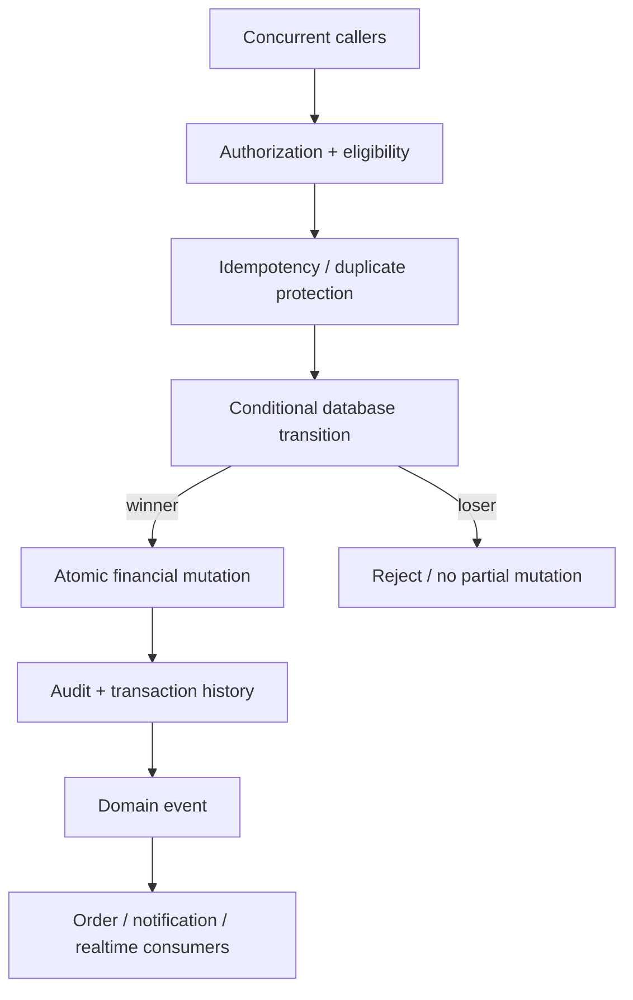
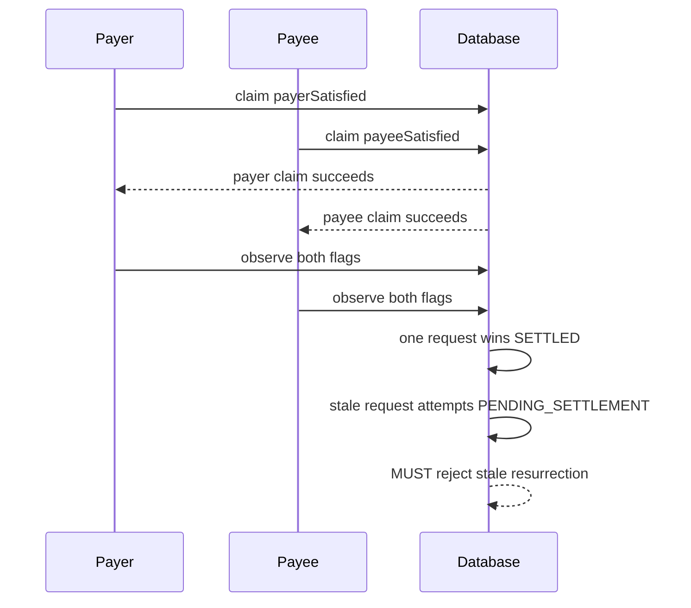
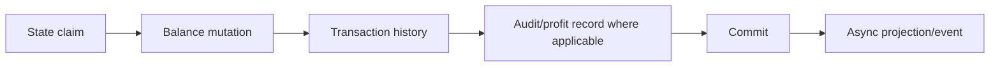

# Escrow Concurrency Transition Matrix

**Status:** IN PROGRESS / ENGINEERING AUDIT
**Date:** 2026-08-30
**Purpose:** Record the concurrency model discovered while auditing the SmartEscrow lifecycle. This document is a design/audit artifact; implementation status must be verified against the active backend branch before any item is marked complete.

## Core invariant

A SmartEscrow may have many callers, retries, workers, and stale clients, but only one authoritative state transition may win when competing requests target the same financial state.



## Transition matrix

| Competition | Required invariant | Current audit position |
|---|---|---|
| FUND vs FUND | Only one request may move DRAFT → FUNDED and debit funds | Database-level single-winner guard added in current engineering batch; verify migration/runtime convergence and concurrent tests before VERIFIED |
| SATISFY vs SATISFY (same party) | A participant can claim their satisfaction once | Conditional flag claim exists; verify stale follow-up behavior |
| PAYER SATISFY vs PAYEE SATISFY | Both flags may lead to exactly one settlement | `_releaseEscrow` has a single-winner settlement boundary; follow-up status mutation requires deeper hardening |
| SETTLED vs PENDING_SETTLEMENT | Terminal state can never be resurrected | **OPEN:** pending follow-up currently needs a conditional state guard |
| DISPUTE vs SETTLEMENT | Once dispute wins, settlement cannot proceed | **OPEN:** verify competing terminal transition claim and financial bucket movement together |
| REFUND vs RELEASE | Principal can leave escrow exactly once | **OPEN:** audit every release/refund caller and terminal-state guard |
| EXPIRY vs FUND | Expiry must not invalidate a successfully funded escrow or vice versa | **OPEN:** verify worker transition predicate and timing race |
| ADMIN RESOLUTION vs WORKER | Only one authoritative dispute outcome may mutate balances | **OPEN:** verify idempotency + conditional terminal transition |
| ORDER SYNC vs ESCROW | Projection must never become more authoritative than escrow | Existing sync is asynchronous; verify stale event handling |

## The currently important race

The satisfaction implementation first atomically claims the participant's satisfaction flag, then reads the row and, if both flags are not yet true, performs a separate update to `PENDING_SETTLEMENT`.

That creates a follow-up transition that must be conditional on the escrow still being in a pending-capable state.



The desired rule is:

```text
SETTLED / RELEASED / REFUNDED / EXPIRED
             ↓
        no backward transition
```

## Financial mutation boundary

Every transition that moves money must be atomic with the corresponding state change.



An asynchronous order update or notification is a projection, never the financial commit itself.

## Verification required before completion

1. Concurrent funding requests against one DRAFT escrow.
2. Concurrent same-party satisfaction requests.
3. Concurrent payer/payee satisfaction requests.
4. Satisfaction racing dispute.
5. Settlement racing expiry.
6. Refund racing release.
7. Duplicate dispute resolution.
8. Worker retry after a terminal transition.
9. Stale asynchronous order-sync event after a newer escrow state.
10. All losing requests leave balances, history, and audit rows unchanged.

## Update rule

When implementation changes a transition:

1. Update this matrix in the same engineering batch.
2. Update the relevant backend plan and visual map.
3. Record the exact invariant being protected.
4. Do not mark VERIFIED until the boundary-level and concurrency tests pass.
5. Preserve unresolved races as OPEN rather than silently removing them from the plan.
