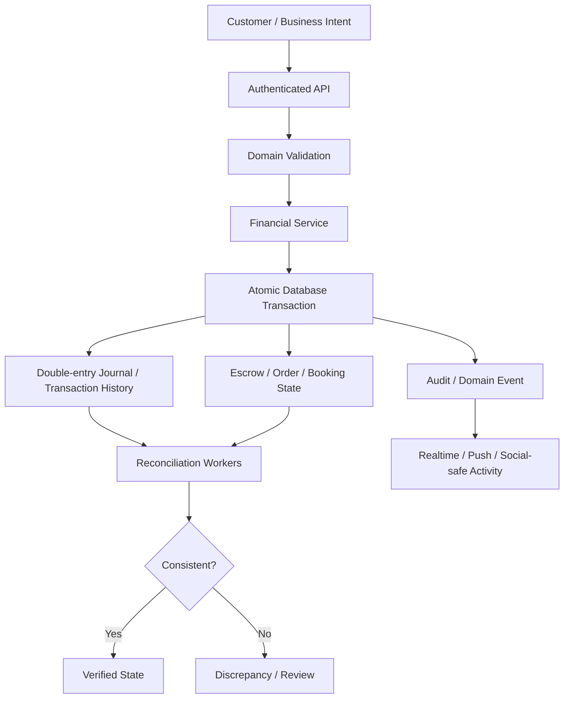
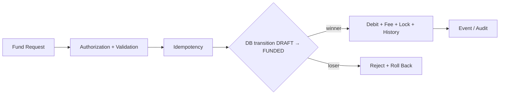
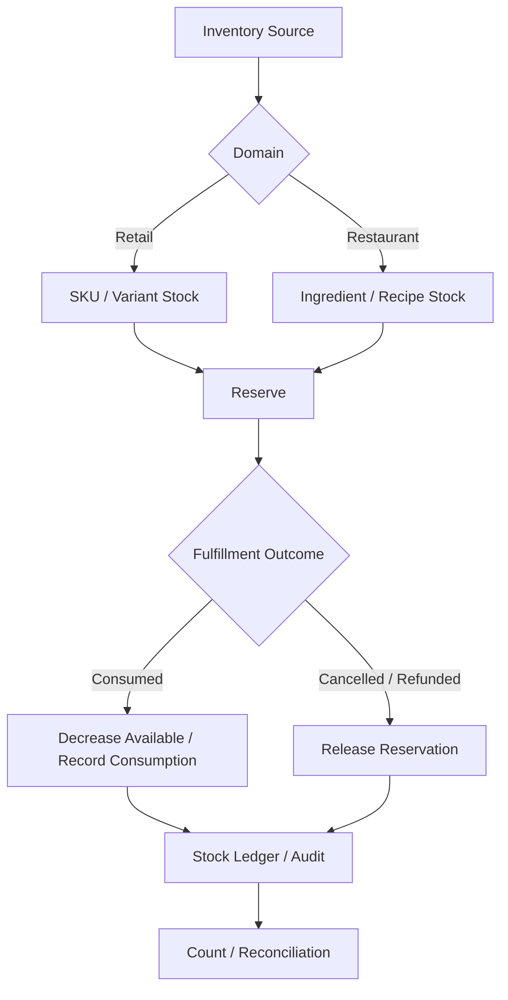
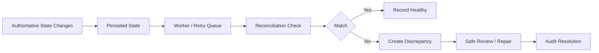

# Financial Foundations & Inventory Deep Dive

**Status:** IN PROGRESS / ARCHITECTURAL AUDIT  
**Last updated:** 2026-08-30 (UTC)  
**Scope:** Existing AZM-backend financial, escrow, ledger, worker, and inventory foundations

## Purpose

This document records a deeper audit of existing foundations before adding another financial subsystem. The goal is to reuse authoritative primitives and identify gaps rather than duplicate functionality.

## Important finding: substantial financial infrastructure already exists

The backend history shows that AZM already has several important financial primitives:

- a double-entry journal ledger (`JournalEntry`) with trial-balance/account-balance/transaction verification capabilities;
- integration helpers for deposits, withdrawals, escrow lock/release, fees, transfers, vault operations and AZM rewards;
- idempotency keys on critical financial endpoints;
- step-up 2FA on high-value financial endpoints;
- append-only audit logging for critical administrative and financial lifecycle actions;
- atomic escrow release/refund/cancellation guards using conditional database updates;
- escrow dispute idempotency and administrative resolution;
- background workers for escrow expiry, withdrawal reconciliation, payout batching and webhook retry;
- multi-instance-safe Redis-backed rate limiting;
- provider-specific Moolre collection/disbursement integrations and webhook handling.

**Architectural consequence:** do not introduce a parallel ledger, parallel escrow engine, or parallel reconciliation worker merely to complete retail checkout. First map the existing primitives and connect new vertical flows to them.

## Financial authority map



## Escrow state safety

Existing escrow work already includes single-winner conditional guards for release/refund and idempotent administrative dispute resolution. Current work adds database-level protection around the funding transition because a service-level pre-read alone cannot establish single-winner concurrency.



The database transition is the final race boundary; application checks remain necessary for authorization and business rules.

## Existing dispute foundation

Historical backend work already introduced unified escrow dispute operations and tests, including administrative resolution. Therefore the next audit is not to create a new dispute subsystem. It is to verify that **every vertical's dispute/refund path reaches the same authoritative escrow and ledger semantics**.

Required map:

```text
Vertical event
   ↓
Dispute / cancellation intent
   ↓
Authoritative eligibility check
   ↓
Single-winner financial transition
   ↓
Ledger / TransactionHistory
   ↓
Order or Booking state
   ↓
Audit + Domain Event
   ↓
Notification / Realtime
   ↓
Reconciliation
```

## Existing ledger foundation

The double-entry journal was introduced as a non-breaking layer alongside existing `TransactionHistory` records. That means the next task is **coverage and consistency**, not another ledger implementation.

Questions being audited:

1. Which financial operations write both journal and legacy transaction history?
2. Which operations still rely only on legacy history?
3. Are journal entries balanced for every operation?
4. Can a failed journal write leave the authoritative money mutation committed?
5. Are asynchronous/retry paths idempotent at both financial and journal layers?
6. Can reconciliation compare order/escrow state with ledger state deterministically?

## Inventory architecture

Retail inventory and restaurant inventory have different domain semantics, but both need a trustworthy quantity lifecycle.



The abstraction target is **shared invariants**, not forced identical domain models.

## Inventory audit questions

Before declaring inventory integrity complete, map every producer of an order/item and determine:

- whether stock is tracked or intentionally unmanaged;
- where reservation occurs;
- whether reservation is atomic with the order/payment decision;
- whether concurrent buyers can oversell;
- how cancellation releases stock;
- how refunds interact with already-consumed stock;
- how partial fulfillment behaves;
- whether stock counts can reconcile against reservations and consumption;
- whether restaurant recipe deduction can safely coexist with retail SKU reservation;
- whether background retries can apply the same consumption twice.

## Worker/reconciliation architecture

The backend already routes many background responsibilities through the worker scheduler, including financial reconciliation and webhook retry. New reconciliation work should extend that architecture rather than creating an isolated cron/setInterval path.



Reconciliation must not silently rewrite financial history.

## Current conclusion

The existing architecture is stronger than a greenfield implementation. The main risk is now **incomplete convergence**, not absence of primitives.

The large engineering batch therefore prioritizes:

1. map all financial writers and journal coverage;
2. map all escrow producers and terminal transitions;
3. verify refund/dispute semantics across verticals;
4. verify inventory producers and concurrency boundaries;
5. connect reconciliation to authoritative state without duplicating ledger logic;
6. expand integration/concurrency tests at real HTTP/service boundaries;
7. only then introduce additional primitives where a verified gap remains.

## Agent instructions

- Do not create a second ledger if an existing authoritative ledger primitive can be extended.
- Do not create a second escrow service for a new vertical without proving the existing abstraction cannot express the required semantics.
- Trace all callers before changing a financial transition.
- Treat journal, transaction history, escrow, order/booking state and external provider state as potentially distinct authorities that require explicit reconciliation.
- Document every newly discovered producer or state transition in this file and the relevant repository plan.
- Keep diagrams synchronized with material lifecycle changes.
- Preserve historical findings; mark them superseded rather than deleting them.
