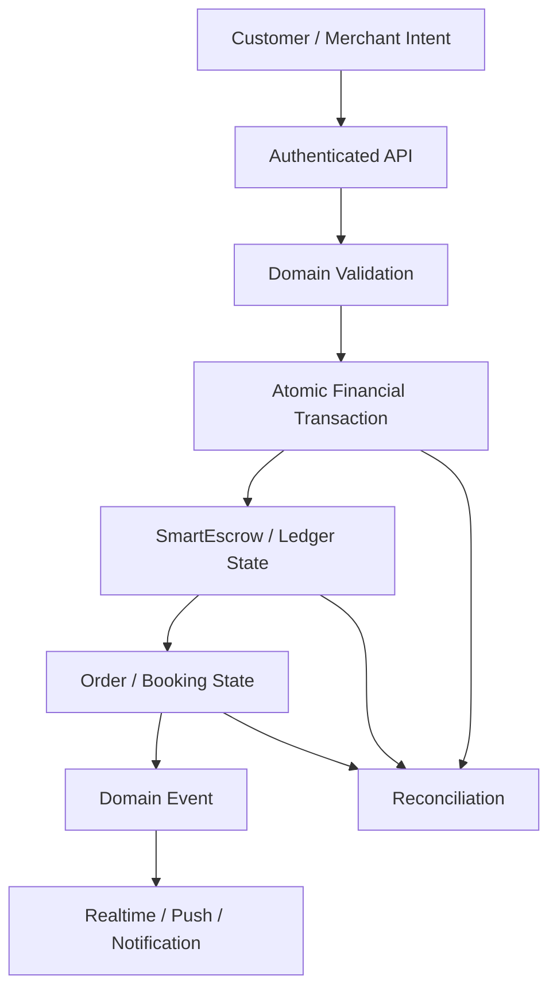
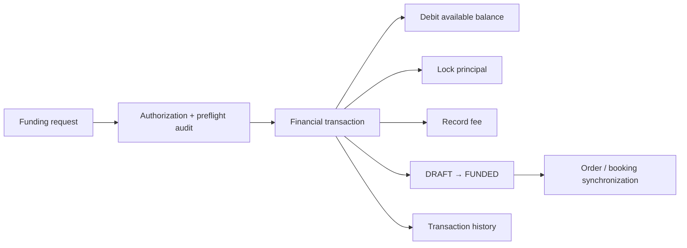
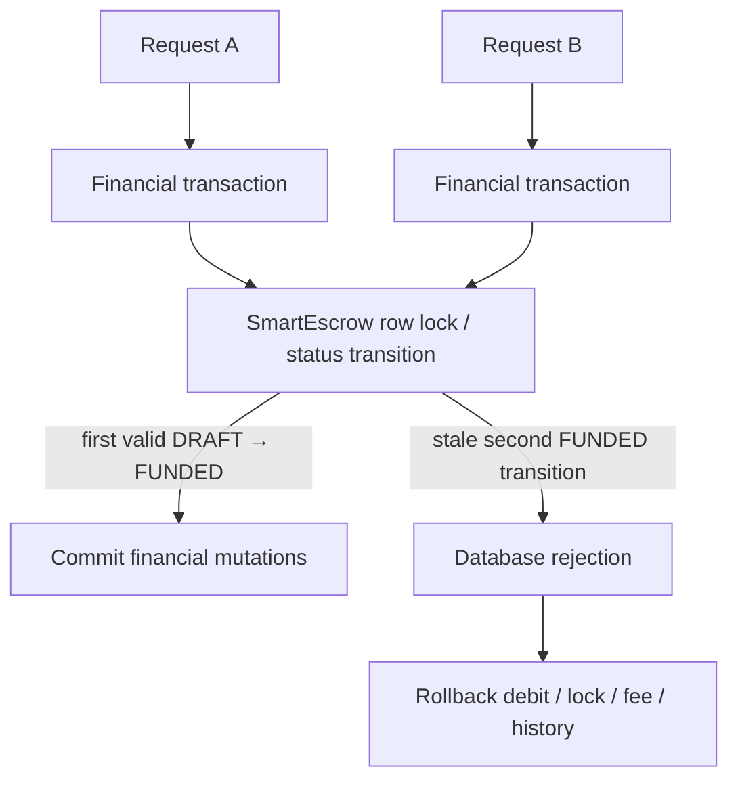
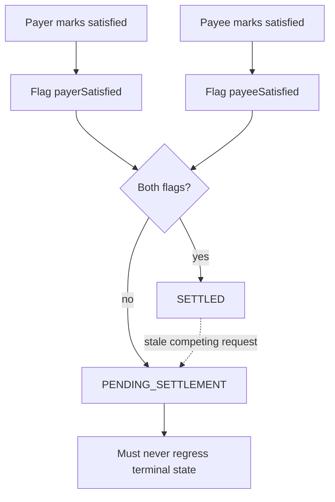
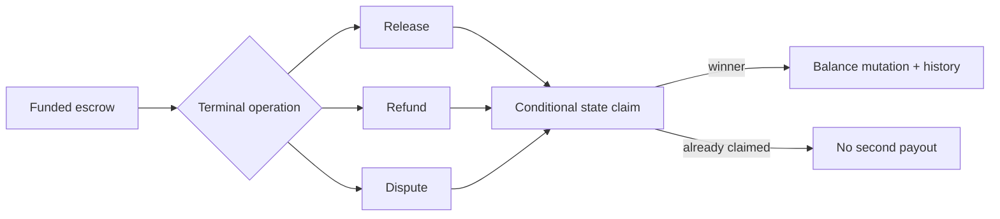
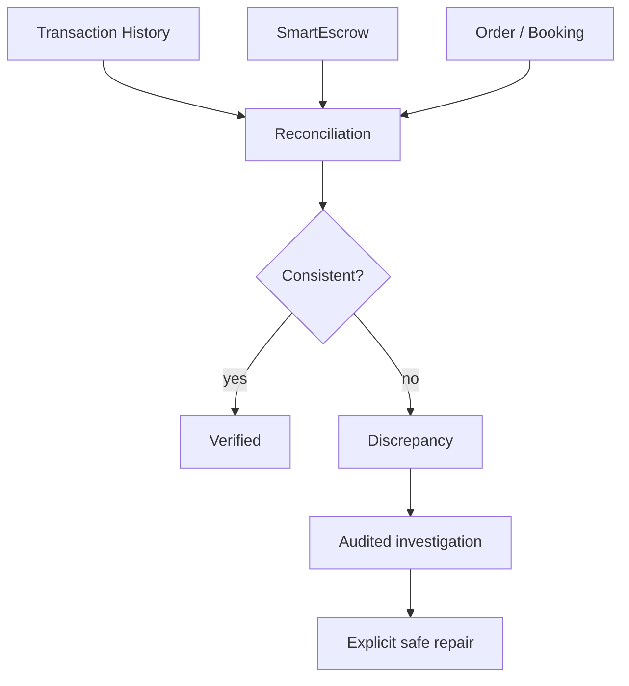

# Financial State Integrity Deep Dive

**Status:** IN PROGRESS  
**Last updated:** 2026-08-30 (UTC)

This is a living deep-dive for the financial/state-machine work currently being accumulated across AZM. It supplements, but does not replace, the repository-specific plans.

## Current authority chain

The UI is never the authority for money or protected state.

## Funding integrity

The SmartEscrow `DRAFT → FUNDED` transition has a database guard. This is shared infrastructure because both the general escrow service and booking escrow service use `SmartEscrow`.

The runtime installer also converges the guard because production currently relies on boot-time schema convergence rather than migration history alone.

## Concurrent funding

The important invariant is not merely that two rows cannot both say `FUNDED`. The losing transaction must also lose **all associated financial mutations** through transaction rollback.

## Satisfaction / settlement race

A discovered concurrency hazard exists around `markSatisfied()`:

The existing service has an atomic satisfaction-flag claim and an atomic settlement claim, but a stale request can still attempt the final `PENDING_SETTLEMENT` update after another request has settled the escrow. The database state guard now blocks `SETTLED`, `RELEASED`, `REFUNDED`, or `EXPIRED` from regressing into `PENDING_SETTLEMENT`.

**Follow-up:** the service should eventually make the pending transition conditional as well, so the application layer expresses the same legal transition rule rather than relying solely on the database guard.

## Release/refund integrity

Release/refund paths use conditional state claims before balance movement. This pattern must remain consistent across retail, general escrow, hotel and transit booking escrow.

## Booking escrow is part of the same integrity boundary

The hotel/transit booking escrow service also funds `SmartEscrow` and performs the same balance/fee/status sequence. Therefore a safety property implemented only in a retail-specific service is insufficient. Shared database state guards are intentionally being treated as platform primitives.

## Business no-show finding

The current business no-show policy has a two-stage behavior:

1. refund the escrow;
2. separately attempt to deduct a business stake penalty.

The penalty can be skipped when the business lacks sufficient stake, and the current result shape reports `penaltyApplied: true` even though the deduction may have been skipped. This is a semantic correctness issue and is queued for the next financial-policy batch.

The longer-term model should distinguish:

`REFUNDED` + `PENALTY_APPLIED`  
`REFUNDED` + `PENALTY_SKIPPED_INSUFFICIENT_STAKE`  
`REFUND_FAILED`

rather than collapsing these into a single success flag.

## Reconciliation target

Reconciliation must observe and identify discrepancies. It must never silently rewrite financial history.

## Required invariants

- One escrow funding operation can win.
- A losing concurrent funding attempt cannot retain a debit, lock, fee, or history row.
- Terminal escrow states cannot regress because of stale requests.
- Release/refund operations can settle an escrow only once.
- Dispute movement cannot duplicate or lose the principal.
- Order/booking state cannot claim financial completion before authoritative escrow/payment state permits it.
- Notifications and realtime are downstream of state, never the source of truth.
- Every critical financial mutation is represented in auditable history.
- Reconciliation can detect disagreement between financial and domain state.
- Error/result semantics distinguish an operation that was skipped from one that actually succeeded.

## Next accumulated work

1. Correct business-no-show penalty result semantics and concurrency.
2. Audit dispute resolution for stale/out-of-order resolution events.
3. Verify every `SmartEscrow` producer and funding path.
4. Add service-level conditional transitions matching the database legal-transition guards.
5. Build reconciliation primitives around transaction history, escrow and order/booking state.
6. Add targeted integration/concurrency tests before the final CI gate.
