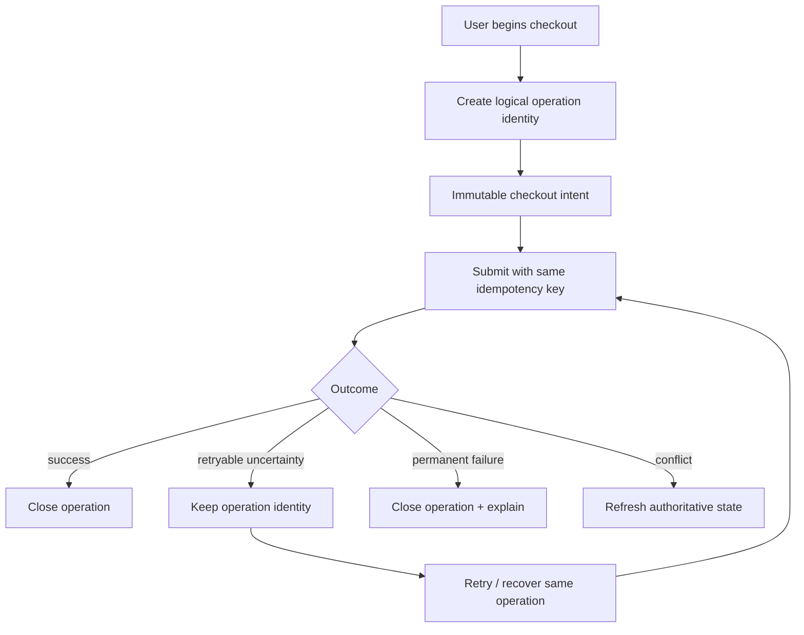
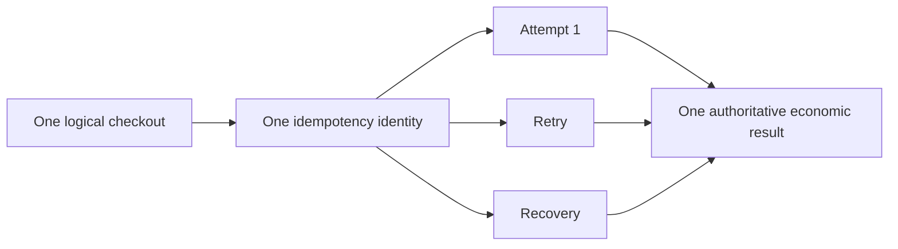

# Frontend Economic Operation Lifecycle

**Scope:** AZM-frontend retail checkout and future financial/economic operations  
**Status:** IN PROGRESS  
**Last updated:** 2026-08-30 (UTC)

## Verified current state

`lib/utils/idempotency_key.dart` already provides a secure UUID-v4-style generator intended for retry-safe financial POST operations.

`StorefrontService.checkoutCart()` already accepts and forwards an optional `idempotencyKey` to the storefront checkout API.

`StorefrontRetailCheckoutGateway.checkout()` currently does not supply that key when calling `checkoutCart()`.

`RetailCheckoutController` currently has no operation identity and simply delegates each submission to the gateway.

## Required lifecycle

## Correct identity lifetime

The key belongs to the **logical checkout operation**, not to an individual HTTP attempt. A network retry must reuse the same key. A new checkout after a completed/permanent outcome must receive a new key.

## Error semantics

The current retail gateway maps every non-`FormatException` thrown by the service to `retryable: true`. This is too coarse for economic operations. The shared API error boundary should eventually preserve canonical error code, HTTP status, retryability and authoritative resource state where supplied.

## Implementation sequence

1. Make the gateway contract require an idempotency key.
2. Have the controller own the logical operation identity and reuse it across retryable outcomes.
3. Pass the identity through the gateway to `StorefrontService.checkoutCart()`.
4. Classify backend failures instead of treating every exception as retryable.
5. Add tests proving retry uses the same identity and permanent/success outcomes start a fresh operation.
6. Trace all other economic entry points before declaring the shared contract complete.

## Important implementation constraint

Do not create a second UUID/idempotency helper. Reuse `IdempotencyKey.generate()`.

Do not put operation identity generation in the HTTP service itself: the service cannot know whether two requests represent the same logical user operation.

## Current blocker

The GitHub contents update operation is currently returning a SHA mismatch even though the fetched branch content reports the same blob SHA. A dedicated branch has been created for the implementation, but the source files have **not** been mutated yet. Do not mark the implementation complete until the branch contains the code and tests.
