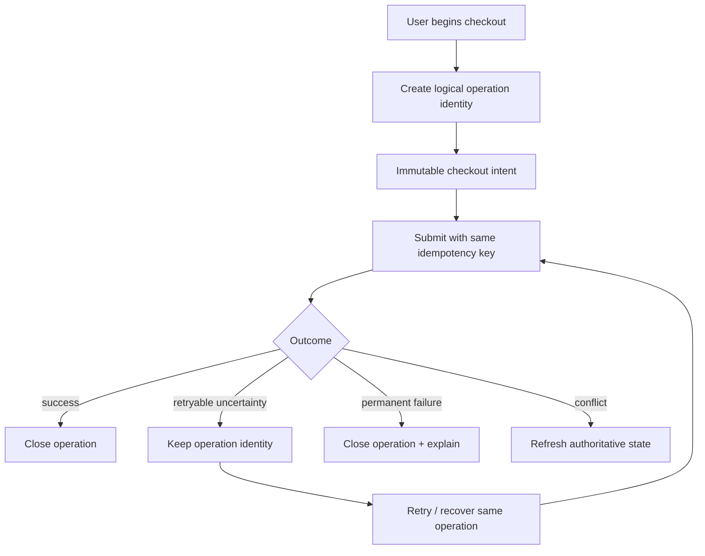
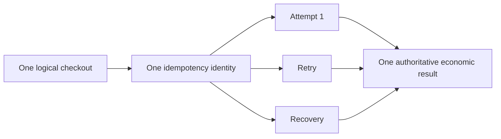

# Frontend Economic Operation Lifecycle

**Scope:** AZM-frontend retail checkout and future financial/economic operations  
**Status:** IN PROGRESS  
**Last updated:** 2026-08-30 (UTC)

## Verified current state

`lib/utils/idempotency_key.dart` already provides a secure UUID-v4-style generator intended for retry-safe financial POST operations.

`StorefrontService.checkoutCart()` already accepts and forwards an optional `idempotencyKey` to the storefront checkout API.

`RetailCheckoutGateway.checkout()` now requires an idempotency key.

`RetailCheckoutOperation` now owns the cart snapshot, checkout options, gateway and idempotency identity. Repeated `submit()` calls on the same operation reuse the same key.

`RetailCheckoutController.begin()` creates the stable logical operation boundary. Its `submit()` method remains available for one-shot callers, while recovery-capable callers should retain the returned operation.

## Required lifecycle

## Correct identity lifetime

The key belongs to the **logical checkout operation**, not to an individual HTTP attempt. A network retry must reuse the same key. A new checkout after a completed/permanent outcome must receive a new key.

Cart values are immutable at the API boundary: cart mutations return new `RetailCart` values. Therefore a changed cart must begin a new logical operation rather than reuse the old operation identity.

## Error semantics

The current retail gateway maps every non-`FormatException` thrown by the service to `retryable: true`. This is too coarse for economic operations. The shared API error boundary should eventually preserve canonical error code, HTTP status, retryability and authoritative resource state where supplied.

## Implementation completed in current batch

1. Gateway contract now requires an idempotency key.
2. Added `RetailCheckoutOperation` to bind one immutable checkout intent to one idempotency identity and one gateway.
3. Added `RetailCheckoutController.begin()` as the explicit recovery-safe operation boundary.
4. One-shot `submit()` remains backward-compatible but is documented as unsuitable for multi-attempt recovery unless the caller supplies the original key.
5. Added tests covering repeated operation submission, new-cart/new-identity behavior, explicit identity preservation and empty-cart rejection.

## Next implementation sequence

1. Trace and wire the real production retail UI caller to retain `RetailCheckoutOperation` across retry/recovery.
2. Classify backend failures instead of treating every exception as retryable.
3. Verify the backend request fingerprint covers exactly the immutable economic intent represented by the operation.
4. Audit `placeStorefrontOrder()` as a second economic entry point and determine whether it is live, legacy, or should converge on canonical checkout.
5. Trace restaurant, hotel and transit economic/booking operations for equivalent retry identity requirements.
6. Add end-to-end contract tests before declaring the shared operation contract complete.

## Important implementation constraints

Do not create a second UUID/idempotency helper. Reuse `IdempotencyKey.generate()`.

Do not put operation identity generation in the HTTP service itself: the service cannot know whether two requests represent the same logical user operation.

Do not generate a new identity inside a gateway for a retry. Gateways transport operation identity; they do not own its lifetime.

Do not reuse an operation after its cart intent has changed. Start a new operation from the new snapshot.

## Current verification state

The source and test changes are committed on the frontend branch `feat/retail-checkout-operation-identity`. CI has intentionally **not** been triggered yet because the agreed workflow is to accumulate a significant coherent batch and perform the full verification cycle at the end.

The implementation is therefore **PARTIALLY COMPLETE / IN PROGRESS**, not VERIFIED.

## Agent update rules

- Update this document whenever an invariant is implemented, disproved, or newly discovered.
- Record the actual source path and behavior; do not infer from intended architecture.
- Keep diagrams synchronized with lifecycle changes.
- Never mark a contract VERIFIED until source, tests and cross-repository behavior have been checked.
- Accumulate coherent changes and reserve expensive CI for the end of a significant batch.
