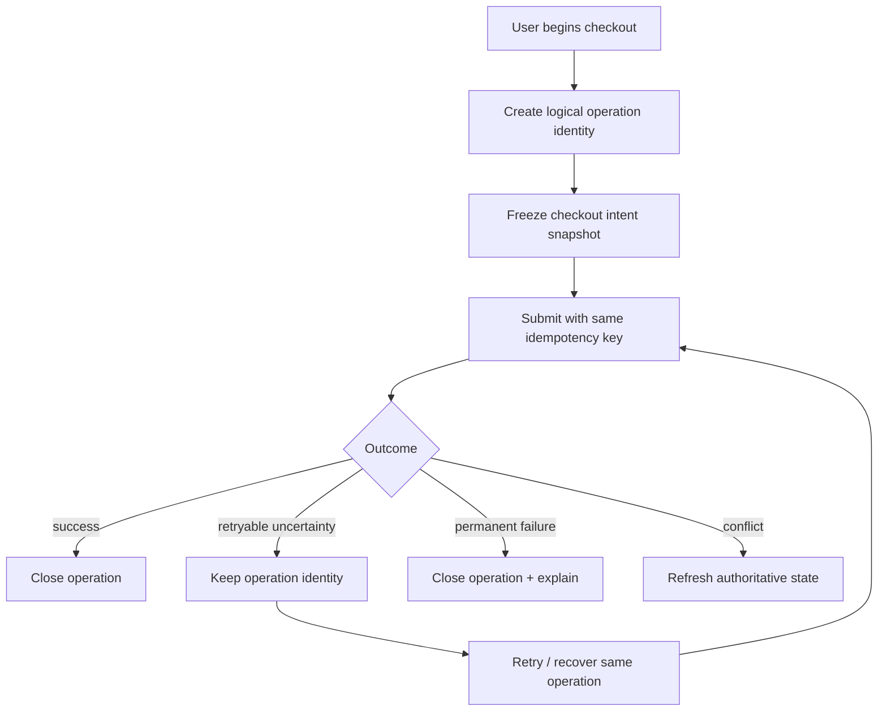
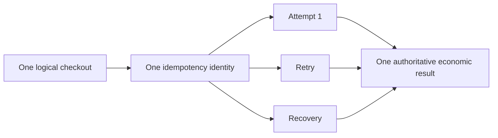
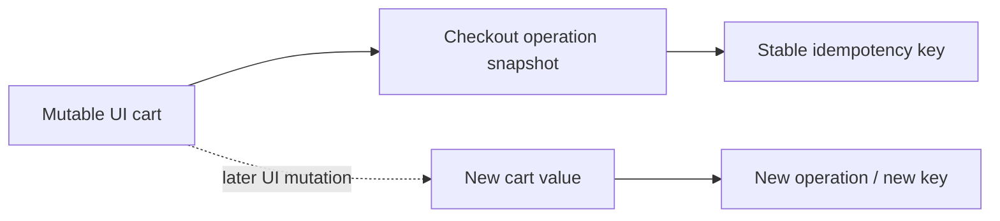

# Frontend Economic Operation Lifecycle

**Scope:** AZM-frontend retail checkout and future financial/economic operations  
**Status:** IN PROGRESS  
**Last updated:** 2026-10-01 (UTC)

## Verified current state

`lib/utils/idempotency_key.dart` already provides a secure UUID-v4-style generator intended for retry-safe financial POST operations.

`StorefrontService.checkoutCart()` already accepts and forwards an optional `idempotencyKey` to the storefront checkout API.

`RetailCheckoutGateway.checkout()` now requires an idempotency key.

`RetailCheckoutOperation` now owns the cart snapshot, checkout options, gateway and idempotency identity. Repeated `submit()` calls on the same operation reuse the same key.

`RetailCheckoutController.begin()` creates the stable logical operation boundary. Its `submit()` method remains available for one-shot callers, while recovery-capable callers should retain the returned operation.

The operation now defensively snapshots the cart lines and their variant maps when created. Later mutation of the caller's source list/map cannot change the economic intent represented by the operation.

## Required lifecycle

```mermaid
flowchart TD
    A[User begins checkout] --> B[Create logical operation identity]
    B --> C[Freeze checkout intent snapshot]
    C --> D[Submit with same idempotency key]
    D --> E{Outcome}
    E -->|success| F[Close operation]
    E -->|retryable uncertainty| G[Keep operation identity]
    G --> H[Retry / recover same operation]
    H --> D
    E -->|permanent failure| I[Close operation + explain]
    E -->|conflict| J[Refresh authoritative state]
```

## Correct identity lifetime

The key belongs to the **logical checkout operation**, not to an individual HTTP attempt. A network retry must reuse the same key. A new checkout after a completed/permanent outcome must receive a new key.

```mermaid
flowchart LR
    O[One logical checkout] --> K[One idempotency identity]
    K --> A[Attempt 1]
    K --> B[Retry]
    K --> C[Recovery]
    A --> R[One authoritative economic result]
    B --> R
    C --> R
```

The operation also freezes the client-side intent at creation time:

```mermaid
flowchart LR
    C[Mutable UI cart] --> S[Checkout operation snapshot]
    S --> K[Stable idempotency key]
    C -. later UI mutation .-> N[New cart value]
    N --> K2[New operation / new key]
```

Cart mutations return new `RetailCart` values. The operation additionally copies its line list and variant maps, preventing external collection mutation from changing an in-flight economic intent.

## Error semantics

The current retail gateway maps every non-`FormatException` thrown by the service to `retryable: true`. This is too coarse for economic operations. The shared API error boundary should eventually preserve canonical error code, HTTP status, retryability and authoritative resource state where supplied.

## Implementation completed in current batch

1. Gateway contract now requires an idempotency key.
2. Added `RetailCheckoutOperation` to bind one immutable checkout intent to one idempotency identity and one gateway.
3. Added `RetailCheckoutController.begin()` as the explicit recovery-safe operation boundary.
4. One-shot `submit()` remains backward-compatible but is documented as unsuitable for multi-attempt recovery unless the caller supplies the original key.
5. Added tests covering repeated operation submission, new-cart/new-identity behavior, explicit identity preservation and empty-cart rejection.
6. Added a regression test proving source cart collections and variant maps cannot mutate an already-created operation snapshot.

## Step 1 outcome (2026-10-01): trace audit + canonical boundary

**Trace result (actual source paths, not intended architecture):**

- **PRODUCTION retail checkout** is `CartScreen` → `StorefrontService.checkoutCart(operationType: 'storefront.cart.checkout', ref: FinancialOperationRef)` → `_resolveOperation` → `DurableOperationRegistry` → `POST /storefront/:businessProfileId/checkout` (instance key as the body `idempotencyKey`). Since TASK-012 all retail adds commit to the shared tray (`cartProvider`), so this is the only live retail checkout caller.
- The `RetailCheckoutController` / `RetailCheckoutOperation` / `StorefrontRetailCheckoutGateway` chain is **NOT production-reachable**: the only gateway construction site was `storefront_widget_registry.dart` passing it into `RetailCollectionBoxWidget.checkoutGateway`, a field the widget stopped reading at TASK-012; `RetailCheckoutController` was constructed only by tests; `showRetailCartSheet` had zero callers.

**Convergence decision:** the FinancialOperationRef path already provides the full required contract (one identity per logical checkout, same-key retry, fingerprint-checked new instance on changed cart, exact-only journal replay, r42 disposition). Forcing `RetailCheckoutOperation` into production would duplicate that machinery, violating the no-second-identity-helper constraint. Instead the boundary is made explicit in code:

- `checkoutCart`'s doc names the durable path as the ONLY authoritative identity path and the pre-armed `idempotencyKey` parameter as legacy transport (no journal/recovery/disposition).
- The controller/operation/gateway chain is documented as quarantined non-production API, retained as this deep-dive's contract surface for step 5 (restaurant/hotel/transit audit).
- The dead wiring was removed: `RetailCollectionBoxWidget.checkoutGateway` (unread since TASK-012) and the registry's never-invoked gateway construction. Zero behavior change.

**Two real defects found in the production path (fixed in frontend PR #130, branch `retail-checkout-operation-identity`):**

1. **The r42 disposition never fired.** `ApiClient.post` throws its own `ApiException` for every non-2xx (`_handleResponse`), but `checkoutCart`/`placeStorefrontOrder` caught `StorefrontApiException` — unreachable on this path — and the POST sat OUTSIDE the try scope, so no answered error could reach any disposition. A definitive pre-economic 4xx silently left the instance armed, diverging from the documented disposition and `postFinancial` parity. Both methods now mirror `postFinancial`: POST inside the disposition scope, classification on `ApiException` (StorefrontApiException clause kept as defense-in-depth), shared `_isDefinitivePreEconomic` helper.
2. `StorefrontService` gained an injectable `ApiClient` seam so the durable path is testable at service level (production behavior identical).

**Regression coverage added:** `test/storefront/checkout_cart_operation_identity_test.dart` (6 tests) pins the real production path end-to-end through the actual durable wiring: same-key retry across lost first attempt and service recreation; materially changed cart → new identity with the old unfinished instance retained; process-death journal replay reproduces the exact wire; definitive 4xx disposes the instance (next attempt = new identity); ambiguous 409 keeps it armed; the service never mints identity itself. 6/6 pass; focused suites (storefront, retail, api client idempotency, durable registry, escrow disposition) 114/114; analyze 0 errors / 0 warnings.

Status: step 1 COMPLETE and MERGED 2026-10-01 at frontend main merge `0fb8d247...`, from exact PR #130 head `9421ffb...`. Steps 2–6 remain open. Step 2 is partially addressed on the live checkout path by the disposition fix; the quarantined gateway still has a coarse `retryable: true` mapping and remains outside the production identity path.

## Next implementation sequence

1. ~~Trace and wire the real production retail UI caller to retain `RetailCheckoutOperation` across retry/recovery.~~ **DONE + MERGED 2026-10-01 — see "Step 1 outcome" above.**
2. ~~Classify backend failures instead of treating every exception as retryable.~~ **IMPLEMENTED 2026-10-01, PR #131 (open/unmerged, head `4f410a1`) — see "Step 2 outcome" below.**
3. ~~Verify the backend request fingerprint covers exactly the immutable economic intent represented by the operation.~~ **VERIFIED 2026-10-01, PR #132 (open/unmerged, test-only, head `0e36b90`) — see "Step 3 outcome" below.**
4. ~~Audit `placeStorefrontOrder()` as a second economic entry point and determine whether it is live, legacy, or should converge on canonical checkout.~~ **AUDITED 2026-10-01 — LIVE, DISTINCT, NO CONVERGENCE NEEDED — see "Step 4 outcome" below.**
5. Trace restaurant, hotel and transit economic/booking operations for equivalent retry identity requirements.
6. Add end-to-end contract tests before declaring the shared operation contract complete.

## Step 2 outcome (2026-10-01): error taxonomy traced and implemented (PR #131, pending review)

**Source audit (what the live wire actually answers).** Both live economic entry points were traced end-to-end (CartScreen → checkoutCart → POST /storefront/:biz/checkout; StorefrontOrderSheet → placeStorefrontOrder → POST /storefront/:biz/order, plus ApiClient.post/_executeWithRefresh and backend routes/storefrontRoutes.js):

- **401 'TOKEN_EXPIRED'** is auto-refreshed ONCE inside `ApiClient._executeWithRefresh` and the request replayed. A 401 that SURFACES therefore means refresh failed or the account is genuinely unauthorized → class `authenticationRequired`.
- **409 on these routes is NOT an ambiguity signal**: the backend answers it ONLY when the durable key was already used for DIFFERENT cart contents (fingerprint mismatch — `storefrontReplayOrConflict` and the P2002 race-catch). An exact replay answers **200 with `idempotent: true`** — the success path. → class `domainConflict` (reconcile against the existing order; a same-key retry alone cannot converge, but the identity stays armed per the step-1 contract).
- **400/403/404** are the explicit pre-economic validations (empty/oversized items, paused business, unavailable product, escrow not offered). → class `definitivePreEconomic`; the step-1 disposition retires the instance.
- **429** → `rateLimited`; **5xx / transport loss / timeout** → `ambiguousOrUnknown`; **malformed 2xx** (success payload without `data.order`) → `ambiguousOrUnknown` via a new malformed-success guard (previously surfaced as SUCCESS with the cart cleared — a real defect this step fixed).
- **Residual backend gap (documented, NOT invented in Flutter):** the backend `wrap` catch-all surfaces uncaught internal errors as **400 with no machine-readable code**. In current source every such throw precedes the order commit (transaction rollback), so 400 stays de-facto pre-economic — but the contract is implicit. Backend should make internal errors distinguishable (dedicated status/code) before the 400→definitive mapping is treated as contractual.

**Implementation.** `StorefrontFailureClass` (5 classes) + pure `StorefrontService.classifyStorefrontFailure` reusing the SAME `_isDefinitivePreEconomic` predicate as the step-1 disposition — classification is a read-only projection and can never contradict the identity lifecycle. No second identity/idempotency abstraction. UI: CartScreen + StorefrontOrderSheet present class-appropriate copy via shared `checkout_failure_message.dart`; an unconfirmed outcome is never worded as "the order failed" (that invites duplicate orders); the generic `SnackBar('Order failed: $e')` is gone from both live callers.

**Adjacent defect fixed during the audit:** CartScreen read the order at `result['data']['order']` — always null because `_parseResponse` already unwraps `{success,data}` — so the success confirmation dialog NEVER showed the orderRef. Now reads `result['order']` (guaranteed a Map by the malformed-success guard).

**Gates on head `4f410a1`:** analyze 0 err / 0 warn (366 info parity); new classification suite 13/13, UI presentation suite 4/4; PR #130 identity regression 6/6 preserved; test/storefront 60/60; retail 18/18; git diff --check clean; exact-head Flutter Quality + Android Integration dispatched. Scope +738/−4, 6 files.

**NOT VERIFIED yet:** PR #131 awaits independent review + merge. Step 4's reachability/contract question is partially answered (both entry points share the taxonomy; placeStorefrontOrder IS live via StorefrontOrderSheet) but its convergence decision is still open.

## Step 3 outcome (2026-10-01): fingerprint contract verified (PR #132, pending review)

**The contract.** The durable checkout converges iff *client-fingerprint-equal ⇒ backend-fingerprint-equal* — a same-key retry must be an exact replay server-side (`200 idempotent:true`), never a 409 collision. Both sides were traced in source: the client fingerprint is sha256 over the canonical ECONOMIC view (`DurableOperationRegistry.fingerprintOf` → `economicView` strips `idempotencyKey`/`clientRequestId` + the secret denylist); the backend fingerprint is sha256 over a fixed projection (`utils/storefrontOrderIdentity.js` `checkoutFingerprint`/`orderFingerprint`).

**Field matrix (AZM-backend @ `d7dd53c`, AZM-frontend main):** the production wire carries items[{productId, quantity, notes?, variants?}], customerNotes?, deliveryNotes?, paymentMode, idempotencyKey. The backend projection covers EVERY persisted, order-determining field of that set; `variants` is fingerprinted-but-not-persisted (conservative); `businessProfileId`/`customerId` are identity (scoped key `v1:<biz>:<user>:sha256(clientKey)` + composite unique), not fingerprint; the durable key is excluded on BOTH sides. **No backend-finer divergence exists** — every field the backend hashes is client-covered.

**Divergence catalog (all pinned to the safe, client-stricter direction):** paymentMode cosmetic case (backend normalizes `.toUpperCase()`, client is raw → changed retry mints a NEW durable key, harmless); item order (material on both sides — conservative); absent-vs-explicit-DIRECT paymentMode (backend-equal, client-different — same safe direction). Client-stricter divergences create fresh logical operations; they can never break convergence.

**Executable pin (PR #132, test-only):** a Dart mirror of the backend algorithm reproduces known-answer digests produced by the REAL backend module at `d7dd53c` byte-for-byte, plus equivalence-class parity over a 9-case checkout mutation matrix and a 4-case single-item matrix. Backend algorithm drift now fails CI and forces a cross-repo contract review. No production code changed; no gap found this step (unlike step 2's wrap-400 finding, which remains open).

**Gates on head `0e36b90`:** analyze 0/0 (366 info parity); contract suite 6/6; identity regression 6/6 (12/12 together); `test/storefront/` 49/49 twice (one documented parallel-load flake, pristine on rerun).

**NOT VERIFIED yet:** PR #132 awaits independent review + merge (and PR #131's review is also still pending).

## Step 4 outcome (2026-10-01): placeStorefrontOrder audited — live, distinct, no convergence (analysis-only, no code change)

**Reachability (traced, all production):** route `/storefront/:businessProfileId` (app_router.dart, reached from StorefrontDiscoveryScreen and BusinessProfileScreen) → `StorefrontScreen`, whose product CTA `'order'` opens `StorefrontOrderSheet` → `placeStorefrontOrder(operationType: 'storefront.order.single', ref: per-sheet FinancialOperationRef)`. NOT legacy. The same screen ALSO has `_addToCart` → cartProvider → CartScreen → `checkoutCart` — so BOTH economic entry points are live side by side, serving distinct user intents: add-to-cart multi-item checkout vs direct single-item order-now.

**Contract classification — every deep-dive requirement is already satisfied:**
- **Identity:** same canonical boundary as checkout — same `DurableOperationRegistry` via [operationType] + [ref] → `_resolveOperation` (no second identity system; the constraint is respected). One durable identity per sheet submit; retry after a lost response reuses the same key.
- **Disposition:** the step-1 fix (POST inside the try, definitive 4xx releases the instance) is present in `placeStorefrontOrder` verbatim — same `_isDefinitivePreEconomic` predicate.
- **Backend contract:** POST `/storefront/:biz/order` runs the IDENTICAL replay-or-conflict discipline as `/checkout` — scoped key lookup (`findFirst` on business+customer+key), `orderFingerprint`, `storefrontReplayOrConflict` (exact replay → 200 `idempotent:true`; fingerprint mismatch → 409). Fingerprint parity with the client's economic view was proven in step 3 (known-answer vectors + 4-case mutation matrix for the /order body).
- **Failure classification:** shares `classifyStorefrontFailure` and the UI copy fix from step 2/PR #131 (pending merge — main still shows the generic `Order failed` SnackBar until #131 lands).

**Decision: NO CONVERGENCE.** `placeStorefrontOrder` is not a duplicate of the cart checkout needing collapse — it is the only path for the storefront screen's direct-order UX, with a distinct operation type, distinct endpoint, and distinct fingerprint projection. Converging it on `checkoutCart` would erase that UX and add cart machinery to a single-item intent. The two entry points are two OPERATIONS, not two identity systems.

**Documented asymmetry (not a defect):** `/order` carries no `paymentMode` — the direct sheet is direct-payment only; `/checkout` normalizes `paymentMode` (default DIRECT, ESCROW possible server-side). If escrow payment is ever offered on the direct sheet, the backend fingerprint must gain the field FIRST (backend-finer divergence is the forbidden direction — see step 3).

**No code change required by this audit; no new PR.**

## Important implementation constraints

Do not create a second UUID/idempotency helper. Reuse `IdempotencyKey.generate()`.

Do not put operation identity generation in the HTTP service itself: the service cannot know whether two requests represent the same logical user operation.

Do not generate a new identity inside a gateway for a retry. Gateways transport operation identity; they do not own its lifetime.

Do not reuse an operation after its cart intent has changed. Start a new operation from the new snapshot.

## Current verification state

Step 1 source/test changes are merged. Exact-head CI was green before merge (Flutter Quality 36891098272; Android Integration 36891102453). Post-merge push CI is not inferred because the available workflow lookup exposes PR-triggered runs only.

The implementation is therefore **PARTIALLY COMPLETE / IN PROGRESS**, not VERIFIED.

## Agent update rules

- Update this document whenever an invariant is implemented, disproved, or newly discovered.
- Record the actual source path and behavior; do not infer from intended architecture.
- Keep diagrams synchronized with lifecycle changes.
- Never mark a contract VERIFIED until source, tests and cross-repository behavior have been checked.
- Accumulate coherent changes and reserve expensive CI for the end of a significant batch.
