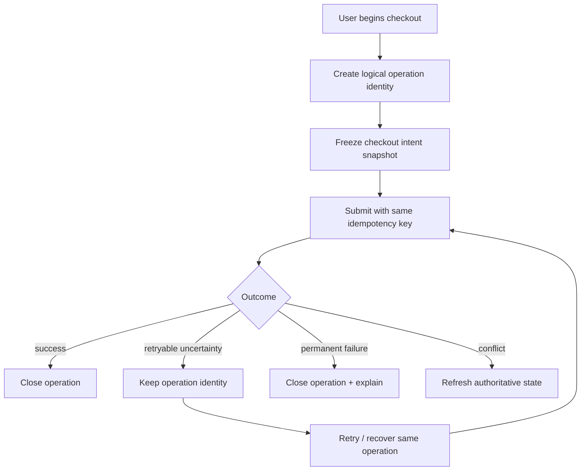
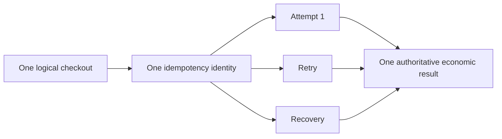
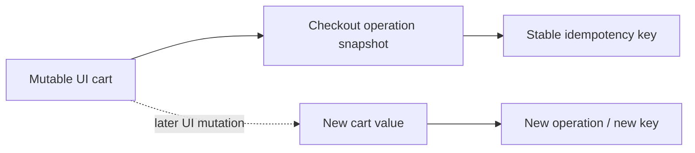

# Frontend Economic Operation Lifecycle

**Scope:** AZM-frontend retail checkout and future financial/economic operations  
**Status:** IN PROGRESS  
**Last updated:** 2026-08-30 (UTC)

## Verified current state

`lib/utils/idempotency_key.dart` already provides a secure UUID-v4-style generator intended for retry-safe financial POST operations.

`StorefrontService.checkoutCart()` already accepts and forwards an optional `idempotencyKey` to the storefront checkout API.

`RetailCheckoutGateway.checkout()` now requires an idempotency key.

`RetailCheckoutOperation` now owns the cart snapshot, checkout options, gateway and idempotency identity. Repeated `submit()` calls on the same operation reuse the same key.

`RetailCheckoutController.begin()` creates the stable logical operation boundary. Its `submit()` method remains available for one-shot callers, while recovery-capable callers should retain the returned operation.

The operation now defensively snapshots the cart lines and their variant maps when created. Later mutation of the caller's source list/map cannot change the economic intent represented by the operation.

## Required lifecycle

```mermaid
flowchart TD
    A[User begins checkout] --> B[Create logical operation identity]
    B --> C[Freeze checkout intent snapshot]
    C --> D[Submit with same idempotency key]
    D --> E{Outcome}
    E -->|success| F[Close operation]
    E -->|retryable uncertainty| G[Keep operation identity]
    G --> H[Retry / recover same operation]
    H --> D
    E -->|permanent failure| I[Close operation + explain]
    E -->|conflict| J[Refresh authoritative state]
```

## Correct identity lifetime

The key belongs to the **logical checkout operation**, not to an individual HTTP attempt. A network retry must reuse the same key. A new checkout after a completed/permanent outcome must receive a new key.

```mermaid
flowchart LR
    O[One logical checkout] --> K[One idempotency identity]
    K --> A[Attempt 1]
    K --> B[Retry]
    K --> C[Recovery]
    A --> R[One authoritative economic result]
    B --> R
    C --> R
```

The operation also freezes the client-side intent at creation time:

```mermaid
flowchart LR
    C[Mutable UI cart] --> S[Checkout operation snapshot]
    S --> K[Stable idempotency key]
    C -. later UI mutation .-> N[New cart value]
    N --> K2[New operation / new key]
```

Cart mutations return new `RetailCart` values. The operation additionally copies its line list and variant maps, preventing external collection mutation from changing an in-flight economic intent.

## Error semantics

The current retail gateway maps every non-`FormatException` thrown by the service to `retryable: true`. This is too coarse for economic operations. The shared API error boundary should eventually preserve canonical error code, HTTP status, retryability and authoritative resource state where supplied.

## Implementation completed in current batch

1. Gateway contract now requires an idempotency key.
2. Added `RetailCheckoutOperation` to bind one immutable checkout intent to one idempotency identity and one gateway.
3. Added `RetailCheckoutController.begin()` as the explicit recovery-safe operation boundary.
4. One-shot `submit()` remains backward-compatible but is documented as unsuitable for multi-attempt recovery unless the caller supplies the original key.
5. Added tests covering repeated operation submission, new-cart/new-identity behavior, explicit identity preservation and empty-cart rejection.
6. Added a regression test proving source cart collections and variant maps cannot mutate an already-created operation snapshot.

## Step 1 outcome (2026-10-01): trace audit + canonical boundary

**Trace result (actual source paths, not intended architecture):**

- **PRODUCTION retail checkout** is `CartScreen` → `StorefrontService.checkoutCart(operationType: 'storefront.cart.checkout', ref: FinancialOperationRef)` → `_resolveOperation` → `DurableOperationRegistry` → `POST /storefront/:businessProfileId/checkout` (instance key as the body `idempotencyKey`). Since TASK-012 all retail adds commit to the shared tray (`cartProvider`), so this is the only live retail checkout caller.
- The `RetailCheckoutController` / `RetailCheckoutOperation` / `StorefrontRetailCheckoutGateway` chain is **NOT production-reachable**: the only gateway construction site was `storefront_widget_registry.dart` passing it into `RetailCollectionBoxWidget.checkoutGateway`, a field the widget stopped reading at TASK-012; `RetailCheckoutController` was constructed only by tests; `showRetailCartSheet` had zero callers.

**Convergence decision:** the FinancialOperationRef path already provides the full required contract (one identity per logical checkout, same-key retry, fingerprint-checked new instance on changed cart, exact-only journal replay, r42 disposition). Forcing `RetailCheckoutOperation` into production would duplicate that machinery, violating the no-second-identity-helper constraint. Instead the boundary is made explicit in code:

- `checkoutCart`'s doc names the durable path as the ONLY authoritative identity path and the pre-armed `idempotencyKey` parameter as legacy transport (no journal/recovery/disposition).
- The controller/operation/gateway chain is documented as quarantined non-production API, retained as this deep-dive's contract surface for step 5 (restaurant/hotel/transit audit).
- The dead wiring was removed: `RetailCollectionBoxWidget.checkoutGateway` (unread since TASK-012) and the registry's never-invoked gateway construction. Zero behavior change.

**Two real defects found in the production path (fixed in frontend PR #130, branch `retail-checkout-operation-identity`):**

1. **The r42 disposition never fired.** `ApiClient.post` throws its own `ApiException` for every non-2xx (`_handleResponse`), but `checkoutCart`/`placeStorefrontOrder` caught `StorefrontApiException` — unreachable on this path — and the POST sat OUTSIDE the try scope, so no answered error could reach any disposition. A definitive pre-economic 4xx silently left the instance armed, diverging from the documented disposition and `postFinancial` parity. Both methods now mirror `postFinancial`: POST inside the disposition scope, classification on `ApiException` (StorefrontApiException clause kept as defense-in-depth), shared `_isDefinitivePreEconomic` helper.
2. `StorefrontService` gained an injectable `ApiClient` seam so the durable path is testable at service level (production behavior identical).

**Regression coverage added:** `test/storefront/checkout_cart_operation_identity_test.dart` (6 tests) pins the real production path end-to-end through the actual durable wiring: same-key retry across lost first attempt and service recreation; materially changed cart → new identity with the old unfinished instance retained; process-death journal replay reproduces the exact wire; definitive 4xx disposes the instance (next attempt = new identity); ambiguous 409 keeps it armed; the service never mints identity itself. 6/6 pass; focused suites (storefront, retail, api client idempotency, durable registry, escrow disposition) 114/114; analyze 0 errors / 0 warnings.

Status: step 1 COMPLETE at PR #130 head (open, unmerged, pending CI + independent review). Steps 2–6 remain open; note that step 2 (backend failure classification) is partially addressed on the checkout path by the disposition fix, but the gateway's coarse `retryable: true` mapping still applies to the quarantined chain only.

## Next implementation sequence

1. ~~Trace and wire the real production retail UI caller to retain `RetailCheckoutOperation` across retry/recovery.~~ **DONE 2026-10-01 — see "Step 1 outcome" above: the real production caller already retains a durable identity via the FinancialOperationRef path; the RetailCheckoutOperation chain is quarantined non-production API.**
2. Classify backend failures instead of treating every exception as retryable.
3. Verify the backend request fingerprint covers exactly the immutable economic intent represented by the operation.
4. Audit `placeStorefrontOrder()` as a second economic entry point and determine whether it is live, legacy, or should converge on canonical checkout. (Partially covered: placeStorefrontOrder is not production-reachable via the retail UI trace; its disposition defect was fixed alongside checkoutCart.)
5. Trace restaurant, hotel and transit economic/booking operations for equivalent retry identity requirements.
6. Add end-to-end contract tests before declaring the shared operation contract complete.

## Important implementation constraints

Do not create a second UUID/idempotency helper. Reuse `IdempotencyKey.generate()`.

Do not put operation identity generation in the HTTP service itself: the service cannot know whether two requests represent the same logical user operation.

Do not generate a new identity inside a gateway for a retry. Gateways transport operation identity; they do not own its lifetime.

Do not reuse an operation after its cart intent has changed. Start a new operation from the new snapshot.

## Current verification state

The source and test changes are committed on the frontend branch `feat/retail-checkout-operation-identity`. CI has intentionally **not** been triggered yet because the agreed workflow is to accumulate a significant coherent batch and perform the full verification cycle at the end.

The implementation is therefore **PARTIALLY COMPLETE / IN PROGRESS**, not VERIFIED.

## Agent update rules

- Update this document whenever an invariant is implemented, disproved, or newly discovered.
- Record the actual source path and behavior; do not infer from intended architecture.
- Keep diagrams synchronized with lifecycle changes.
- Never mark a contract VERIFIED until source, tests and cross-repository behavior have been checked.
- Accumulate coherent changes and reserve expensive CI for the end of a significant batch.
