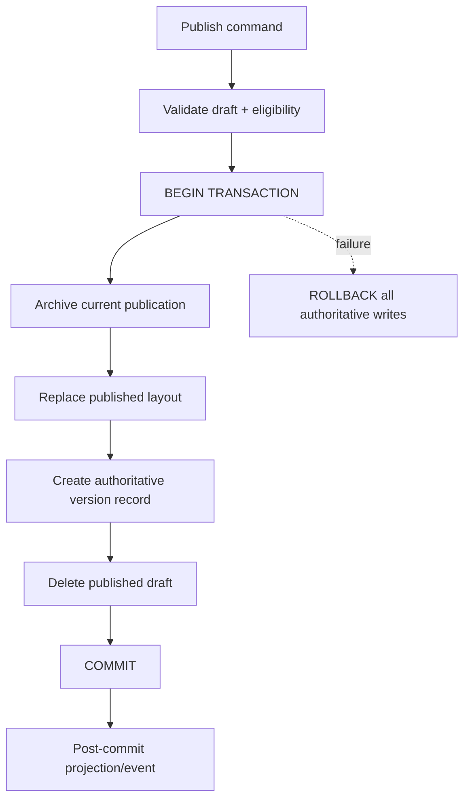

# Storefront Publish Transaction Audit

**Repository:** `AzamanLTD/AZM-backend`  
**Status:** IN PROGRESS  
**Date:** 2026-08-30 (UTC)

## Verified finding

`publishLayout()` performs a multi-write state transition: it reads the draft/current publication, archives the current publication into version history, deletes the old published layout, creates the new published layout, creates a second history record, and finally deletes the draft.

These writes must be treated as one authoritative publish operation. A failure between writes can otherwise leave publication/history/draft state inconsistent.

## Required invariant

No intermediate publication/history/draft state should become externally authoritative.

## Why this is a platform concern

The storefront already uses optimistic concurrency for draft editing. Publish should provide the complementary atomicity guarantee: optimistic concurrency prevents stale authors from overwriting newer drafts; a database transaction prevents a single publish from partially committing.

## Open verification

- Inspect the Prisma client usage and transaction conventions in this repository.
- Confirm whether callers depend on the returned published object after commit.
- Confirm version-number allocation remains safe under concurrent publishes.
- Add failure-boundary tests for each multi-write stage.
- Check whether realtime publication events are emitted only after commit.

## Agent rule

Do not refactor `publishLayout()` from the diagram alone. First trace its callers, transaction conventions, version constraints, and event publication path. Then implement the smallest canonical transaction boundary and test the failure cases.
